MODELAGEM COMPUTACIONAL DA EMISSÃO DE CO2 DO SOLO EM ÁREAS DE PASTAGEM
DEGRADADAS E MANEJO SILVIPASTORIL NO CERRADO BRASILEIRO
================

#### *Zanini, E. L.; Panosso, A. R.;*

##### Financiamento:…

<!-- README.md is generated from README.Rmd. Please edit that file -->

## Resumo do Trabalho

### Aquisição dos dados de CO<sub>2</sub> atmosférico (xCO2)

A aquisição de dados de X<sub>co2</sub> e SIF, e seus processamentos
iniciais pode ser encontrados no link:

#### <https://arpanosso.github.io/oco2/>

Para facilitar o acesso, os dodos foram adquiridos por meio do pacote
`{fco2}`.

``` r
## Instalando pacotes (se necessário)
# install.packages("devtools")
# Sys.getenv("GITHUB_PAT")
# Sys.unsetenv("GITHUB_PAT")
# Sys.getenv("GITHUB_PAT")
# devtools::install_github("arpanosso/fco2r")
library(readxl)
library(tidyverse)
library(geobr)
library(fco2r)
library(skimr)
library(tidymodels)
library(ISLR)
library(modeldata)
library(vip)
library(ggpubr)
library(patchwork)
source("R/my_fun.R")

# Definindo o plano de multisession
future::plan("multisession")
```

### Carregando os dados meteorológicos

``` r
dados_estacao <- read_excel("data-raw/xlsx/estacao_meteorologia_ilha_solteira.xlsx", na = "NA") 
glimpse(dados_estacao)
#> Rows: 1,826
#> Columns: 16
#> $ data    <dttm> 2015-01-01, 2015-01-02, 2015-01-03, 2015-01-04, 2015-01-05, 2…
#> $ Tmed    <dbl> 30.5, 30.0, 26.8, 27.1, 27.0, 27.6, 30.2, 28.2, 28.5, 29.9, 30…
#> $ Tmax    <dbl> 36.5, 36.7, 35.7, 34.3, 33.2, 36.4, 37.2, 32.4, 37.1, 38.1, 38…
#> $ Tmin    <dbl> 24.6, 24.5, 22.9, 22.7, 22.3, 22.8, 22.7, 24.0, 23.0, 23.3, 24…
#> $ Umed    <dbl> 66.6, 70.4, 82.7, 76.8, 81.6, 75.5, 65.8, 70.0, 72.9, 67.6, 66…
#> $ Umax    <dbl> 89.6, 93.6, 99.7, 95.0, 98.3, 96.1, 99.2, 83.4, 90.7, 97.4, 90…
#> $ Umin    <dbl> 42.0, 44.2, 52.9, 43.8, 57.1, 47.5, 34.1, 57.4, 42.7, 38.3, 37…
#> $ PkPa    <dbl> 97.2, 97.3, 97.4, 97.5, 97.4, 97.5, 97.4, 97.4, 97.4, 97.4, 97…
#> $ Rad     <dbl> 23.6, 24.6, 20.2, 21.4, 17.8, 19.2, 27.0, 15.2, 21.6, 24.3, 24…
#> $ PAR     <dbl> 496.6, 513.3, 430.5, 454.0, 378.2, 405.4, 565.7, 317.2, 467.5,…
#> $ Eto     <dbl> 5.7, 5.8, 4.9, 5.1, 4.1, 4.8, 6.2, 4.1, 5.5, 5.7, 5.9, 6.1, 6.…
#> $ Velmax  <dbl> 6.1, 4.8, 12.1, 6.2, 5.1, 4.5, 4.6, 5.7, 5.8, 5.2, 5.2, 4.7, 6…
#> $ Velmin  <dbl> 1.0, 1.0, 1.2, 1.0, 0.8, 0.9, 0.9, 1.5, 1.2, 0.8, 0.8, 1.2, 1.…
#> $ Dir_vel <dbl> 17.4, 261.9, 222.0, 25.0, 56.9, 74.9, 53.4, 89.0, 144.8, 303.9…
#> $ chuva   <dbl> 0.0, 0.0, 3.3, 0.0, 0.0, 0.0, 0.0, 0.0, 0.0, 0.0, 0.0, 0.0, 0.…
#> $ inso    <dbl> 7.9, 8.7, 5.2, 6.2, 3.4, 4.5, 10.5, 1.3, 6.3, 8.4, 8.6, 7.9, 1…
```

### Conhecendo a base de dados de CO<sub>2</sub> atmosférico

``` r
# help(oco2_br)
glimpse(fco2r::oco2_br)
#> Rows: 37,387
#> Columns: 18
#> $ longitude                                                     <dbl> -70.5, -…
#> $ longitude_bnds                                                <chr> "-71.0:-…
#> $ latitude                                                      <dbl> -5.5, -4…
#> $ latitude_bnds                                                 <chr> "-6.0:-5…
#> $ time_yyyymmddhhmmss                                           <dbl> 2.014091…
#> $ time_bnds_yyyymmddhhmmss                                      <chr> "2014090…
#> $ altitude_km                                                   <dbl> 3307.8, …
#> $ alt_bnds_km                                                   <chr> "0.0:661…
#> $ fluorescence_radiance_757nm_uncert_idp_ph_sec_1_m_2_sr_1_um_1 <dbl> 7.272876…
#> $ fluorescence_radiance_757nm_idp_ph_sec_1_m_2_sr_1_um_1        <dbl> 2.537127…
#> $ xco2_moles_mole_1                                             <dbl> 0.000394…
#> $ aerosol_total_aod                                             <dbl> 0.148579…
#> $ fluorescence_offset_relative_771nm_idp                        <dbl> 0.016753…
#> $ fluorescence_at_reference_ph_sec_1_m_2_sr_1_um_1              <dbl> 2.615319…
#> $ fluorescence_radiance_771nm_idp_ph_sec_1_m_2_sr_1_um_1        <dbl> 3.088582…
#> $ fluorescence_offset_relative_757nm_idp                        <dbl> 0.013969…
#> $ fluorescence_radiance_771nm_uncert_idp_ph_sec_1_m_2_sr_1_um_1 <dbl> 5.577878…
#> $ XCO2                                                          <dbl> 387.2781…
```

Inicialmente devemos transformar os dados de concentração de
CO<sub>2</sub>, variável `xco2_moles_mole_1` para ppm em seguida devemos
criar as variáveis de data a partir da variável `time_yyyymmddhhmmss`.

``` r
oco2<-oco2_br  %>% 
         mutate(
           xco2 = xco2_moles_mole_1*1e06,
           data = ymd_hms(time_yyyymmddhhmmss),
           ano = year(data),
           mes = month(data),
           dia = day(data),
           dia_semana = wday(data))
```

Existe uma tendência de aumento monotônica mundial da concentração de
CO2 na atmosfera, assim, ela deve ser retirada para podermos observar as
tendências regionais.

``` r
oco2  %>%  
  ggplot(aes(x=data,y=xco2)) +
  geom_point(color="blue") +
  geom_line(color="red")
```

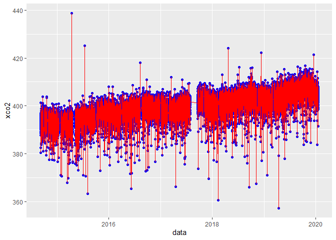<!-- -->

Agora devemos retirar a tendência ao longo do tempo, para isso, dentro
do período específico, faremos a retirada por meio de um ajuste linear:

``` r
oco2  %>%  
  mutate(x= 1:nrow(oco2))  %>%  
  ggplot(aes(x=data,y=xco2)) +
  geom_point(shape=21,color="black",fill="gray") +
  geom_smooth(method = "lm") +
  stat_regline_equation(ggplot2::aes(
  label =  paste(..eq.label.., ..rr.label.., sep = "*plain(\",\")~~")))
```

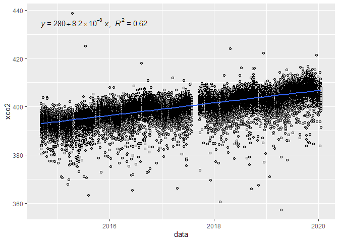<!-- -->

Extrair os coeficientes $\alpha$ e $\beta$ da análise de regressão
linear $(y=\alpha+\beta x)$.

``` r
modelo_linear_tendencia <- lm(xco2~data,
          data = oco2)
coefs <- modelo_linear_tendencia$coefficients
```

Criando a variável `xco2_est` a partir da retirada da tendência.

``` r
oco2 |> 
  mutate(
    xco2_est = coefs[1] + coefs[2] * as.numeric(data),
    delta = xco2_est - xco2,
    XCO2 = (coefs[1]-delta) - (mean(xco2) - coefs[1])
  ) 
#> # A tibble: 37,387 × 26
#>    longitude longitude_bnds latitude latitude_bnds time_yyyymmddhhmmss
#>        <dbl> <chr>             <dbl> <chr>                       <dbl>
#>  1     -70.5 -71.0:-70.0        -5.5 -6.0:-5.0                 2.01e13
#>  2     -70.5 -71.0:-70.0        -4.5 -5.0:-4.0                 2.01e13
#>  3     -69.5 -70.0:-69.0       -10.5 -11.0:-10.0               2.01e13
#>  4     -69.5 -70.0:-69.0        -9.5 -10.0:-9.0                2.01e13
#>  5     -69.5 -70.0:-69.0        -8.5 -9.0:-8.0                 2.01e13
#>  6     -69.5 -70.0:-69.0        -7.5 -8.0:-7.0                 2.01e13
#>  7     -69.5 -70.0:-69.0        -6.5 -7.0:-6.0                 2.01e13
#>  8     -69.5 -70.0:-69.0        -5.5 -6.0:-5.0                 2.01e13
#>  9     -68.5 -69.0:-68.0       -10.5 -11.0:-10.0               2.01e13
#> 10     -46.5 -47.0:-46.0        -1.5 -2.0:-1.0                 2.01e13
#> # ℹ 37,377 more rows
#> # ℹ 21 more variables: time_bnds_yyyymmddhhmmss <chr>, altitude_km <dbl>,
#> #   alt_bnds_km <chr>,
#> #   fluorescence_radiance_757nm_uncert_idp_ph_sec_1_m_2_sr_1_um_1 <dbl>,
#> #   fluorescence_radiance_757nm_idp_ph_sec_1_m_2_sr_1_um_1 <dbl>,
#> #   xco2_moles_mole_1 <dbl>, aerosol_total_aod <dbl>,
#> #   fluorescence_offset_relative_771nm_idp <dbl>, …
glimpse(oco2)
#> Rows: 37,387
#> Columns: 24
#> $ longitude                                                     <dbl> -70.5, -…
#> $ longitude_bnds                                                <chr> "-71.0:-…
#> $ latitude                                                      <dbl> -5.5, -4…
#> $ latitude_bnds                                                 <chr> "-6.0:-5…
#> $ time_yyyymmddhhmmss                                           <dbl> 2.014091…
#> $ time_bnds_yyyymmddhhmmss                                      <chr> "2014090…
#> $ altitude_km                                                   <dbl> 3307.8, …
#> $ alt_bnds_km                                                   <chr> "0.0:661…
#> $ fluorescence_radiance_757nm_uncert_idp_ph_sec_1_m_2_sr_1_um_1 <dbl> 7.272876…
#> $ fluorescence_radiance_757nm_idp_ph_sec_1_m_2_sr_1_um_1        <dbl> 2.537127…
#> $ xco2_moles_mole_1                                             <dbl> 0.000394…
#> $ aerosol_total_aod                                             <dbl> 0.148579…
#> $ fluorescence_offset_relative_771nm_idp                        <dbl> 0.016753…
#> $ fluorescence_at_reference_ph_sec_1_m_2_sr_1_um_1              <dbl> 2.615319…
#> $ fluorescence_radiance_771nm_idp_ph_sec_1_m_2_sr_1_um_1        <dbl> 3.088582…
#> $ fluorescence_offset_relative_757nm_idp                        <dbl> 0.013969…
#> $ fluorescence_radiance_771nm_uncert_idp_ph_sec_1_m_2_sr_1_um_1 <dbl> 5.577878…
#> $ XCO2                                                          <dbl> 387.2781…
#> $ xco2                                                          <dbl> 394.3686…
#> $ data                                                          <dttm> 2014-09…
#> $ ano                                                           <dbl> 2014, 20…
#> $ mes                                                           <dbl> 9, 9, 9,…
#> $ dia                                                           <int> 6, 6, 6,…
#> $ dia_semana                                                    <dbl> 7, 7, 7,…
```

``` r
oco2  %>%  
  ggplot(aes(x=data,y=XCO2)) +
  geom_point(shape=21,color="black",fill="gray") +
  geom_smooth(method = "lm") +
  stat_regline_equation(ggplot2::aes(
  label =  paste(..eq.label.., ..rr.label.., sep = "*plain(\",\")~~")))
```

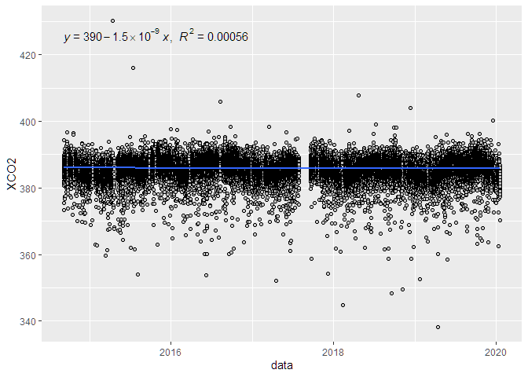<!-- -->

### Alguns gráficos

``` r
oco2 %>%
  sample_n(1000) %>%
  ggplot(aes(x = longitude, y = latitude)) +
  geom_point(color = "blue")
```

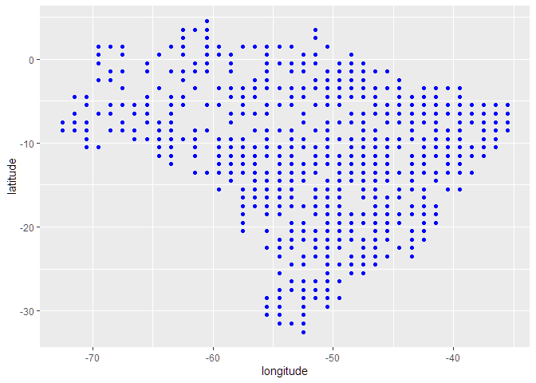<!-- -->

### Carregando o contorno do território

``` r
br <- geobr::read_country(showProgress = FALSE)
```

### Construindo o mapa com os pontos

``` r
br %>%
  ggplot() +
  geom_sf(fill = "white") +
    geom_point(data=oco2 %>%
                 sample_n(1000),
             aes(x=longitude,y=latitude),
             shape=3,
             col="red",
             alpha=0.2)
```

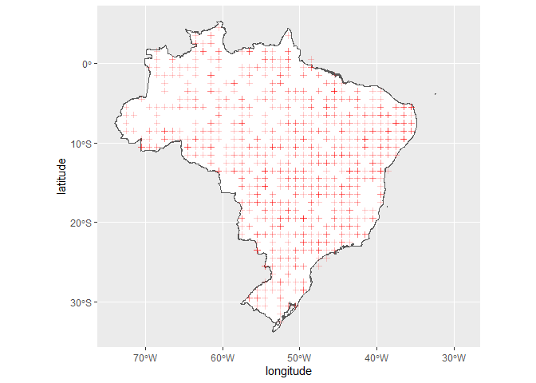<!-- -->

Observe que utilizamos `dplyr::sample_n()` para retirar apenas $1000$
amostras do total do banco de dados $37387$.

#### Estatísticas descritivas

``` r
skim(oco2_br)
```

|                                                  |         |
|:-------------------------------------------------|:--------|
| Name                                             | oco2_br |
| Number of rows                                   | 37387   |
| Number of columns                                | 18      |
| \_\_\_\_\_\_\_\_\_\_\_\_\_\_\_\_\_\_\_\_\_\_\_   |         |
| Column type frequency:                           |         |
| character                                        | 4       |
| numeric                                          | 14      |
| \_\_\_\_\_\_\_\_\_\_\_\_\_\_\_\_\_\_\_\_\_\_\_\_ |         |
| Group variables                                  | None    |

Data summary

**Variable type: character**

| skim_variable | n_missing | complete_rate | min | max | empty | n_unique | whitespace |
|:---|---:|---:|---:|---:|---:|---:|---:|
| longitude_bnds | 0 | 1 | 11 | 11 | 0 | 39 | 0 |
| latitude_bnds | 0 | 1 | 7 | 11 | 0 | 38 | 0 |
| time_bnds_yyyymmddhhmmss | 0 | 1 | 29 | 29 | 0 | 1765 | 0 |
| alt_bnds_km | 0 | 1 | 11 | 20 | 0 | 64 | 0 |

**Variable type: numeric**

| skim_variable | n_missing | complete_rate | mean | sd | p0 | p25 | p50 | p75 | p100 | hist |
|:---|---:|---:|---:|---:|---:|---:|---:|---:|---:|:---|
| longitude | 0 | 1 | -5.120000e+01 | 8.280000e+00 | -7.350000e+01 | -5.650000e+01 | -5.050000e+01 | -4.450000e+01 | -3.550000e+01 | ▂▃▇▇▅ |
| latitude | 0 | 1 | -1.179000e+01 | 7.850000e+00 | -3.250000e+01 | -1.750000e+01 | -1.050000e+01 | -5.500000e+00 | 4.500000e+00 | ▂▃▇▇▃ |
| time_yyyymmddhhmmss | 0 | 1 | 2.016952e+13 | 1.564571e+10 | 2.014091e+13 | 2.016020e+13 | 2.017052e+13 | 2.018092e+13 | 2.020012e+13 | ▇▇▅▆▇ |
| altitude_km | 0 | 1 | 3.123200e+03 | 1.108800e+02 | 2.555700e+03 | 3.056350e+03 | 3.126310e+03 | 3.196250e+03 | 3.307800e+03 | ▁▁▂▇▇ |
| fluorescence_radiance_757nm_uncert_idp_ph_sec_1_m_2_sr_1_um_1 | 0 | 1 | 8.520719e+17 | 5.599367e+18 | -9.999990e+05 | 6.323256e+17 | 6.951592e+17 | 7.671609e+17 | 9.365539e+20 | ▇▁▁▁▁ |
| fluorescence_radiance_757nm_idp_ph_sec_1_m_2_sr_1_um_1 | 0 | 1 | -1.358150e+18 | 1.946775e+20 | -3.400736e+22 | 7.735159e+17 | 1.676353e+18 | 2.566089e+18 | 2.316112e+20 | ▁▁▁▁▇ |
| xco2_moles_mole_1 | 0 | 1 | 0.000000e+00 | 0.000000e+00 | 0.000000e+00 | 0.000000e+00 | 0.000000e+00 | 0.000000e+00 | 0.000000e+00 | ▁▁▇▁▁ |
| aerosol_total_aod | 0 | 1 | 4.828100e+02 | 7.848572e+04 | 2.000000e-02 | 1.100000e-01 | 1.700000e-01 | 2.600000e-01 | 1.487623e+07 | ▇▁▁▁▁ |
| fluorescence_offset_relative_771nm_idp | 0 | 1 | -4.814400e+02 | 2.193698e+04 | -9.999990e+05 | 1.000000e-02 | 1.000000e-02 | 2.000000e-02 | 1.230000e+00 | ▁▁▁▁▇ |
| fluorescence_at_reference_ph_sec_1_m_2_sr_1_um_1 | 0 | 1 | 1.296932e+18 | 2.245185e+18 | -8.394901e+19 | 2.014560e+17 | 1.268715e+18 | 2.395217e+18 | 8.610756e+19 | ▁▁▇▁▁ |
| fluorescence_radiance_771nm_idp_ph_sec_1_m_2_sr_1_um_1 | 0 | 1 | 1.904438e+18 | 2.236381e+18 | -8.453983e+19 | 9.694709e+17 | 1.987682e+18 | 2.918792e+18 | 4.338306e+19 | ▁▁▁▇▁ |
| fluorescence_offset_relative_757nm_idp | 0 | 1 | -3.744400e+02 | 1.934763e+04 | -9.999990e+05 | 1.000000e-02 | 1.000000e-02 | 2.000000e-02 | 2.086000e+01 | ▁▁▁▁▇ |
| fluorescence_radiance_771nm_uncert_idp_ph_sec_1_m_2_sr_1_um_1 | 0 | 1 | 5.235574e+17 | 7.580471e+16 | -9.999990e+05 | 4.695467e+17 | 5.216793e+17 | 5.736367e+17 | 1.143215e+18 | ▁▂▇▁▁ |
| XCO2 | 0 | 1 | 3.858900e+02 | 3.120000e+00 | 3.383400e+02 | 3.844100e+02 | 3.862900e+02 | 3.878000e+02 | 4.301400e+02 | ▁▁▇▁▁ |

### Conhecendo a base de dados de emissão de CO<sub>2</sub> do solo

``` r
# help(data_fco2)
glimpse(data_fco2)
#> Rows: 15,397
#> Columns: 39
#> $ experimento       <chr> "Espacial", "Espacial", "Espacial", "Espacial", "Esp…
#> $ data              <date> 2001-07-10, 2001-07-10, 2001-07-10, 2001-07-10, 200…
#> $ manejo            <chr> "convencional", "convencional", "convencional", "con…
#> $ tratamento        <chr> "AD_GN", "AD_GN", "AD_GN", "AD_GN", "AD_GN", "AD_GN"…
#> $ revolvimento_solo <lgl> FALSE, FALSE, FALSE, FALSE, FALSE, FALSE, FALSE, FAL…
#> $ data_preparo      <date> 2001-07-01, 2001-07-01, 2001-07-01, 2001-07-01, 200…
#> $ conversao         <date> 1970-01-01, 1970-01-01, 1970-01-01, 1970-01-01, 197…
#> $ cobertura         <lgl> TRUE, TRUE, TRUE, TRUE, TRUE, TRUE, TRUE, TRUE, TRUE…
#> $ cultura           <chr> "milho_soja", "milho_soja", "milho_soja", "milho_soj…
#> $ x                 <dbl> 0, 40, 80, 10, 25, 40, 55, 70, 20, 40, 60, 10, 70, 3…
#> $ y                 <dbl> 0, 0, 0, 10, 10, 10, 10, 10, 20, 20, 20, 25, 25, 30,…
#> $ longitude_muni    <dbl> 782062.7, 782062.7, 782062.7, 782062.7, 782062.7, 78…
#> $ latitude_muni     <dbl> 7647674, 7647674, 7647674, 7647674, 7647674, 7647674…
#> $ estado            <chr> "SP", "SP", "SP", "SP", "SP", "SP", "SP", "SP", "SP"…
#> $ municipio         <chr> "Jaboticabal", "Jaboticabal", "Jaboticabal", "Jaboti…
#> $ ID                <int> 1, 2, 3, 4, 5, 6, 7, 8, 9, 10, 11, 12, 13, 14, 15, 1…
#> $ prof              <chr> "0-0.1", "0-0.1", "0-0.1", "0-0.1", "0-0.1", "0-0.1"…
#> $ FCO2              <dbl> 1.080, 0.825, 1.950, 0.534, 0.893, 0.840, 1.110, 1.8…
#> $ Ts                <dbl> 18.73, 18.40, 19.20, 18.28, 18.35, 18.47, 19.10, 18.…
#> $ Us                <dbl> NA, NA, NA, NA, NA, NA, NA, NA, NA, NA, NA, NA, NA, …
#> $ pH                <dbl> 5.1, 5.1, 5.8, 5.3, 5.5, 5.7, 5.6, 6.4, 5.3, 5.8, 5.…
#> $ MO                <dbl> 20, 24, 25, 23, 23, 21, 26, 23, 25, 24, 26, 20, 25, …
#> $ P                 <dbl> 46, 26, 46, 78, 60, 46, 55, 92, 55, 60, 48, 71, 125,…
#> $ K                 <dbl> 2.4, 2.2, 5.3, 3.6, 3.4, 2.9, 4.0, 2.3, 3.3, 3.6, 4.…
#> $ Ca                <dbl> 25, 30, 41, 27, 33, 38, 35, 94, 29, 36, 37, 29, 50, …
#> $ Mg                <dbl> 11, 11, 25, 11, 15, 20, 16, 65, 11, 17, 15, 11, 30, …
#> $ H_Al              <dbl> 31, 31, 22, 28, 27, 22, 22, 12, 31, 28, 28, 31, 18, …
#> $ SB                <dbl> 38.4, 43.2, 71.3, 41.6, 50.6, 60.9, 55.0, 161.3, 43.…
#> $ CTC               <dbl> 69.4, 74.2, 93.3, 69.6, 77.9, 82.9, 77.0, 173.3, 74.…
#> $ V                 <dbl> 55, 58, 76, 60, 65, 73, 71, 93, 58, 67, 67, 58, 82, …
#> $ Ds                <dbl> NA, NA, NA, NA, NA, NA, NA, NA, NA, NA, NA, NA, NA, …
#> $ Macro             <dbl> NA, NA, NA, NA, NA, NA, NA, NA, NA, NA, NA, NA, NA, …
#> $ Micro             <dbl> NA, NA, NA, NA, NA, NA, NA, NA, NA, NA, NA, NA, NA, …
#> $ VTP               <dbl> NA, NA, NA, NA, NA, NA, NA, NA, NA, NA, NA, NA, NA, …
#> $ PLA               <dbl> NA, NA, NA, NA, NA, NA, NA, NA, NA, NA, NA, NA, NA, …
#> $ AT                <dbl> NA, NA, NA, NA, NA, NA, NA, NA, NA, NA, NA, NA, NA, …
#> $ SILTE             <dbl> NA, NA, NA, NA, NA, NA, NA, NA, NA, NA, NA, NA, NA, …
#> $ ARG               <dbl> NA, NA, NA, NA, NA, NA, NA, NA, NA, NA, NA, NA, NA, …
#> $ HLIFS             <dbl> NA, NA, NA, NA, NA, NA, NA, NA, NA, NA, NA, NA, NA, …
```

Observe que utilizamos `dplyr::sample_n()` para retirar apenas $1000$
amostras do total do banco de dados $146,646$.

#### Estatísticas descritivas

``` r
visdat::vis_miss(data_fco2 %>% 
                   sample_n(15000))
```

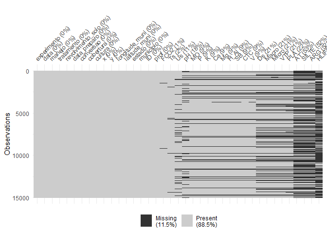<!-- -->

#### Estatísticas descritivas

``` r
# skim(dados_estacao)
```

``` r
dados_estacao <- dados_estacao %>% 
                   drop_na()
visdat::vis_miss(dados_estacao)
```

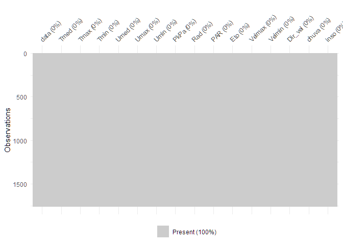<!-- -->

``` r
# Lista do xCO2
# 01 passar as datas que estão em ano-mes-dia-horas-min-segundos
# para uma outra coluna denominada 'data' como ano-mes-dia
# Fazer em pipeline, usar o mutate do pacote dplyr e provavelmente
# a funçoes do pacote lubridate
oco2 <- oco2  %>% 
  mutate (
    ano = time_yyyymmddhhmmss%/%1e10,
    mês = time_yyyymmddhhmmss%/%1e8 %%100,
    dia = time_yyyymmddhhmmss%/%1e6 %%100,
    data = as.Date(stringr::str_c(ano,mês,dia,sep="-"))
  ) %>% 
  glimpse()
#> Rows: 37,387
#> Columns: 25
#> $ longitude                                                     <dbl> -70.5, -…
#> $ longitude_bnds                                                <chr> "-71.0:-…
#> $ latitude                                                      <dbl> -5.5, -4…
#> $ latitude_bnds                                                 <chr> "-6.0:-5…
#> $ time_yyyymmddhhmmss                                           <dbl> 2.014091…
#> $ time_bnds_yyyymmddhhmmss                                      <chr> "2014090…
#> $ altitude_km                                                   <dbl> 3307.8, …
#> $ alt_bnds_km                                                   <chr> "0.0:661…
#> $ fluorescence_radiance_757nm_uncert_idp_ph_sec_1_m_2_sr_1_um_1 <dbl> 7.272876…
#> $ fluorescence_radiance_757nm_idp_ph_sec_1_m_2_sr_1_um_1        <dbl> 2.537127…
#> $ xco2_moles_mole_1                                             <dbl> 0.000394…
#> $ aerosol_total_aod                                             <dbl> 0.148579…
#> $ fluorescence_offset_relative_771nm_idp                        <dbl> 0.016753…
#> $ fluorescence_at_reference_ph_sec_1_m_2_sr_1_um_1              <dbl> 2.615319…
#> $ fluorescence_radiance_771nm_idp_ph_sec_1_m_2_sr_1_um_1        <dbl> 3.088582…
#> $ fluorescence_offset_relative_757nm_idp                        <dbl> 0.013969…
#> $ fluorescence_radiance_771nm_uncert_idp_ph_sec_1_m_2_sr_1_um_1 <dbl> 5.577878…
#> $ XCO2                                                          <dbl> 387.2781…
#> $ xco2                                                          <dbl> 394.3686…
#> $ data                                                          <date> 2014-09…
#> $ ano                                                           <dbl> 2014, 20…
#> $ mes                                                           <dbl> 9, 9, 9,…
#> $ dia                                                           <dbl> 6, 6, 6,…
#> $ dia_semana                                                    <dbl> 7, 7, 7,…
#> $ mês                                                           <dbl> 9, 9, 9,…
```

``` r
dados_estacao <- dados_estacao %>% 
  mutate(
    ano = lubridate::year(data),
    mês = lubridate::month(data),
    dia = lubridate::day(data),
    data = as.Date(stringr::str_c(ano,mês,dia,sep="-"))
)
```

## Manipulação dos bancos de dados Fco2 e de estação.

``` r
# atributos <- data_fco2
atributos <- left_join(data_fco2, dados_estacao, by = "data")
```

#### Listando as datas em ambos os bancos de dados

``` r
# Lista das datas de FCO2 
lista_data_fco2 <- unique(atributos$data)
lista_data_oco2 <- unique(oco2$data)
lista_data_estacao <- unique(dados_estacao$data)
datas_fco2 <- paste0(lubridate::year(lista_data_fco2),"-",lubridate::month(lista_data_fco2)) %>% unique()

datas_oco2 <- paste0(lubridate::year(lista_data_oco2),"-",lubridate::month(lista_data_oco2)) %>% unique()
datas <- datas_fco2[datas_fco2 %in% datas_oco2]
```

Criação as listas de datas, que é chave para a mesclagem dos arquivos.

``` r
fco2 <- atributos %>% 
  mutate(ano_mes = paste0(lubridate::year(data),"-",lubridate::month(data))) %>% 
  dplyr::filter(ano_mes %in% datas)

xco2 <- oco2 %>%   
  mutate(ano_mes=paste0(ano,"-",mês)) %>% 
  dplyr::filter(ano_mes %in% datas)
```

Abordagem usando o join do `{dplyr}`

``` r
memory.limit(size=10001)
#> [1] Inf
data_set <- left_join(fco2 %>% 
            mutate(ano = lubridate::year(data),
                   mes = lubridate::month(data)
                   ) %>% 
            select(ID, data, cultura, ano, mes, x, y, FCO2:ARG, ano_mes,Tmed,Tmax, Tmin, Umed,
                   Umax, Umin, PkPa, Rad, Eto, Velmax, Velmin, Dir_vel,
                   chuva, inso), 
          xco2 %>% 
            select(data,mês,dia,longitude,latitude,XCO2,fluorescence_radiance_757nm_idp_ph_sec_1_m_2_sr_1_um_1,fluorescence_radiance_771nm_idp_ph_sec_1_m_2_sr_1_um_1, ano_mes), by = "ano_mes") %>% 
  mutate(dist = sqrt((longitude-(-51.423519))^2+(latitude-(-20.362911))^2),
         SIF = (fluorescence_radiance_757nm_idp_ph_sec_1_m_2_sr_1_um_1*2.6250912*10^(-19)  + 1.5*fluorescence_radiance_771nm_idp_ph_sec_1_m_2_sr_1_um_1* 2.57743*10^(-19))/2)

data_set<-data_set %>%
  select(-fluorescence_radiance_757nm_idp_ph_sec_1_m_2_sr_1_um_1, -fluorescence_radiance_771nm_idp_ph_sec_1_m_2_sr_1_um_1 )  %>% 
  filter(dist <= .16, FCO2 <= 20 ) 

visdat::vis_miss(data_set %>% 
                   sample_n(2000)
                 )
```

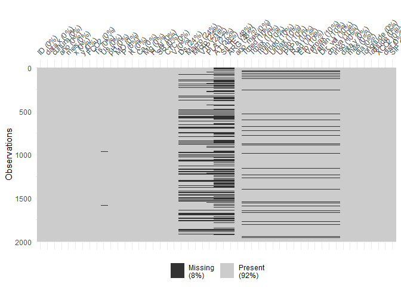<!-- -->

``` r
# head(data_set)
# fco2$ano_mes %>% unique()
# xco2$ano_mes %>% unique()
# data_set$ano_mes %>% unique()
```

## Filtrando os dados

``` r
data_set <- data_set %>% 
  filter(
    ano == 2018
  ) %>% 
  rename(
    data = data.x
  ) %>% janitor::clean_names()
```

``` r
dias_leitura <- data_set$data %>% unique()
area <- data_set$cultura %>% unique()
data_set <- data_set %>% 
  group_by(data, cultura) %>% 
  distinct(x, y, .keep_all = TRUE) %>% 
  filter(
    # data == "2018-05-25",
    # cultura == "pasto",
    # data <= "2018-07-15"
    ) %>% 
  select(-dist)
data_set$data %>% unique()
#>  [1] "2018-05-25" "2018-05-31" "2018-06-05" "2018-06-14" "2018-06-20"
#>  [6] "2018-06-26" "2018-07-04" "2018-07-09" "2018-05-22" "2018-06-01"
#> [11] "2018-06-04" "2018-06-16" "2018-06-18" "2018-06-25" "2018-07-03"
#> [16] "2018-07-10" "2018-06-06" "2018-06-15" "2018-06-21" "2018-07-31"
#> [21] "2018-08-07" "2018-08-21" "2018-08-28" "2018-09-04" "2018-09-11"
#> [26] "2018-09-22" "2018-10-09" "2018-10-16"
```

``` r
data_set_mean <- data_set %>% 
  summarise(
    fco2_m = mean(fco2, na.rm = TRUE),
    ts_m = mean(ts, na.rm = TRUE),
    us_m = mean(us, na.rm = TRUE),
    tmed_m = mean(tmed, na.rm = TRUE),
    tmax_m = mean(tmax, na.rm = TRUE),
    tmin_m = mean(tmin, na.rm = TRUE),
    umed_m = mean(umed, na.rm = TRUE),
    umax_m = mean(umax, na.rm = TRUE),
    pk_pa_m = mean(pk_pa, na.rm = TRUE),
    rad_m = mean(rad, na.rm = TRUE),
    eto_m = mean(eto, na.rm = TRUE),
    velmax_m = mean(velmax, na.rm = TRUE),
    velmin_m = mean(velmin, na.rm = TRUE),
    dir_vel_m = mean(dir_vel, na.rm = TRUE),
    chuva_m = mean(chuva, na.rm = TRUE),
    inso_m = mean(inso, na.rm = TRUE),
    xco2_m = mean(xco2, na.rm = TRUE),
    sif_m = mean(sif, na.rm = TRUE)
  )
```

# Matriz de Correlação Temporal

``` r
names(data_set_mean) <- names(data_set_mean) %>% str_remove(.,"_m")
mcor <- cor(data_set_mean %>% 
              ungroup() %>% 
              filter(cultura == "pasto") %>% 
              select(-data, -cultura, -dir_vel) %>% 
              relocate(fco2:us,xco2,sif)
            )
head(round(mcor,2))
#>       fco2    ts    us  xco2   sif  tmed  tmax  tmin  umed  umax pk_pa   rad
#> fco2  1.00  0.58 -0.18  0.24  0.54  0.57  0.48  0.74  0.25  0.24 -0.57  0.48
#> ts    0.58  1.00  0.01 -0.03  0.64  0.51  0.46  0.64  0.02  0.05 -0.64  0.47
#> us   -0.18  0.01  1.00 -0.52 -0.07 -0.20 -0.25 -0.09  0.16  0.16  0.37 -0.31
#> xco2  0.24 -0.03 -0.52  1.00 -0.28  0.18  0.25  0.11 -0.09 -0.08 -0.15  0.37
#> sif   0.54  0.64 -0.07 -0.28  1.00  0.43  0.40  0.58  0.22  0.22 -0.58  0.46
#> tmed  0.57  0.51 -0.20  0.18  0.43  1.00  0.96  0.87 -0.54 -0.40 -0.75  0.79
#>        eto velmax velmin chuva  inso
#> fco2  0.33  -0.23  -0.36  0.57  0.17
#> ts    0.44  -0.25  -0.16  0.52  0.10
#> us   -0.28  -0.11   0.12 -0.11 -0.11
#> xco2  0.25   0.06  -0.25  0.05  0.42
#> sif   0.53   0.17   0.20  0.67 -0.19
#> tmed  0.77  -0.11  -0.27  0.31  0.64
col <- colorRampPalette(c("green", "blue"))(20)
corrplot::corrplot(mcor, method = "ellipse", type = "upper",tl.col="black",tl.srt=90,insig = "blank",na.label = " ", 
                   na.label.col = "white")
```

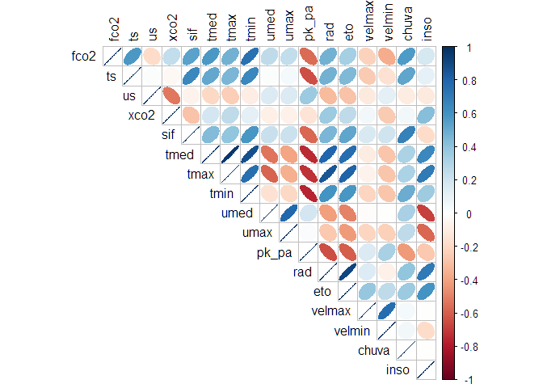<!-- -->

``` r
names(data_set_mean) <- names(data_set_mean) %>% str_remove(.,"_m")
mcor <- cor(data_set_mean %>% 
              ungroup() %>% 
              filter(cultura == "silvipastoril") %>% 
              select(-data, -cultura, -dir_vel) %>% 
              relocate(fco2:us,xco2,sif)
            )
head(round(mcor,2))
#>      fco2    ts    us  xco2   sif  tmed tmax  tmin  umed  umax pk_pa  rad  eto
#> fco2 1.00  0.59  0.23  0.25  0.60  0.55 0.51  0.64  0.19  0.24 -0.55 0.60 0.55
#> ts   0.59  1.00 -0.21  0.13  0.48  0.66 0.56  0.79 -0.01  0.02 -0.72 0.32 0.51
#> us   0.23 -0.21  1.00 -0.31  0.31 -0.01 0.05 -0.03  0.10  0.11  0.15 0.27 0.13
#> xco2 0.25  0.13 -0.31  1.00 -0.37  0.27 0.29  0.24  0.00 -0.06 -0.14 0.16 0.17
#> sif  0.60  0.48  0.31 -0.37  1.00  0.34 0.32  0.43  0.11  0.13 -0.50 0.52 0.56
#> tmed 0.55  0.66 -0.01  0.27  0.34  1.00 0.96  0.89 -0.45 -0.27 -0.80 0.58 0.69
#>      velmax velmin chuva  inso
#> fco2  -0.03  -0.10  0.60  0.20
#> ts    -0.02  -0.04  0.38 -0.10
#> us     0.03   0.11  0.25  0.23
#> xco2  -0.05  -0.26  0.05  0.21
#> sif    0.27   0.27  0.64 -0.06
#> tmed  -0.09  -0.25  0.31  0.39
col <- colorRampPalette(c("green", "blue"))(20)
corrplot::corrplot(mcor, method = "ellipse", type = "upper",tl.col="black",tl.srt=90,insig = "blank",na.label = " ", na.label.col = "white")
```

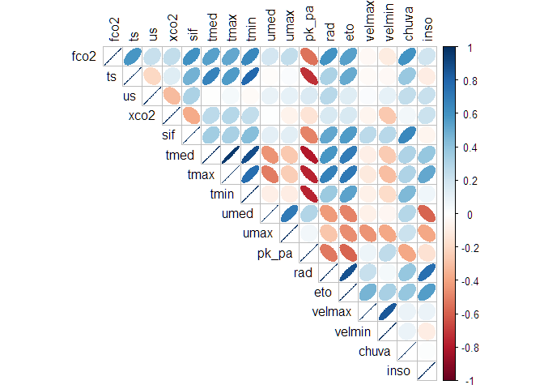<!-- -->

``` r
data_set_mean %>% 
  ggplot(aes(x=data, y=fco2, color = cultura)) + 
  geom_line() +
  geom_point() +
  # facet_wrap(~cultura) + 
  theme_bw() +
  theme(legend.position = "top")+
  scale_color_manual(values = c("black","red"))
```

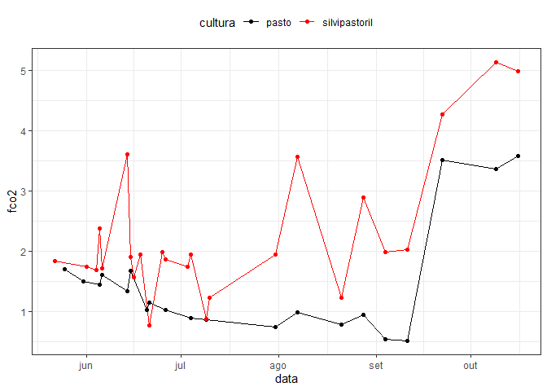<!-- -->

# Correlação Espacial

``` r
data_set %>% 
  # filter(data == "2018-05-22") %>% 
  ggplot(aes(x=x,y=y)) + 
  geom_point() +
  theme_bw() +
  facet_wrap(~cultura, scale="free") + 
  theme_bw()
```

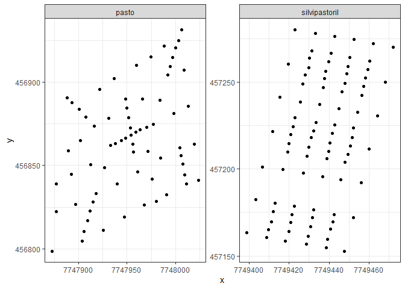<!-- -->

``` r
data_set %>% ungroup() %>%  
  filter(data == "2018-05-22") %>% 
  ggplot(aes(x=x,y=y, label=id)) + 
  geom_text(aes(label = id),
              size = 3.5)
```

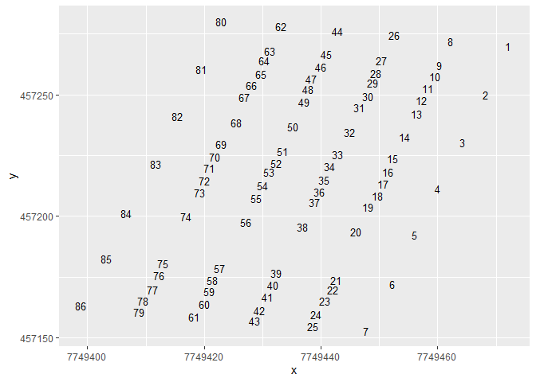<!-- -->

``` r
silv_point_pol <- c(86,80,1,7)
silv_pol <- data_set %>% ungroup() %>%  
  filter(data == "2018-05-22",
         id %in% silv_point_pol) %>% 
  select(x, y) %>% as.matrix()
# silv_pol <- silv_pol %>% rbind(silv_pol[1,])
silv_pol <- silv_pol[c(4,3,1,2,4),]

library(sp)
p = Polygon(silv_pol)
ps = Polygons(list(p),1)
sps = SpatialPolygons(list(ps))
plot(sps)
```

<!-- -->

``` r
data_set %>% ungroup() %>%  
  filter(data == "2018-05-25") %>% 
  ggplot(aes(x=x,y=y, label=id)) + 
  geom_text(aes(label = id),
              size = 3.5)
```

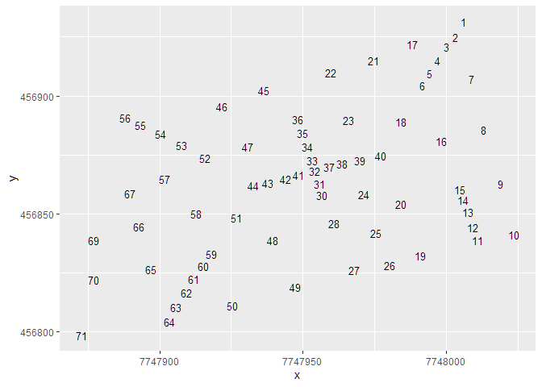<!-- -->

``` r
pasto_point_pol <- c(71,69,56,1,10,64)
pasto_pol <- data_set %>% ungroup() %>%  
  filter(data == "2018-05-25",
         id %in% pasto_point_pol) %>% 
  select(x, y) %>% as.matrix()
# pasto_pol <- pasto_pol %>% rbind(pasto_pol[1,])
pasto_pol <- pasto_pol[c(6,5,3,1,2,4,6),]

library(sp)
p = Polygon(pasto_pol)
ps = Polygons(list(p),1)
sps = SpatialPolygons(list(ps))
plot(sps)
```

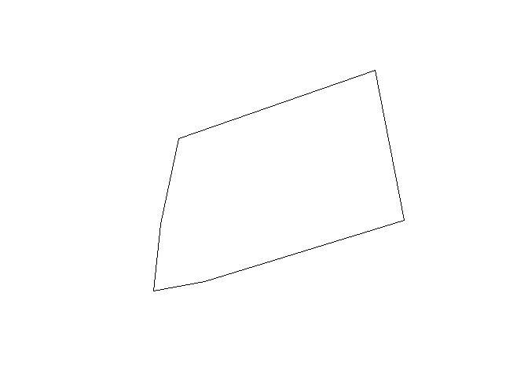<!-- -->

``` r
def_pol <- function(x, y, pol){
  as.logical(sp::point.in.polygon(point.x = x,
                                  point.y = y,
                                  pol.x = pol[,1],
                                  pol.y = pol[,2]))
}
```

## Correlação por ponto de emissão

``` r
data_set_nest <- data_set %>%
  ungroup() %>% 
  select(id,cultura,x,y,fco2,xco2,sif) %>% 
  #rename(dia = data) %>% 
  group_by(cultura, id) %>% 
  nest(fco2:sif) 
```

``` r
data_set_nest$data[1]
#> [[1]]
#> # A tibble: 8 × 3
#>    fco2  xco2    sif
#>   <dbl> <dbl>  <dbl>
#> 1  1.14  386.  0.125
#> 2  0.64  386.  0.125
#> 3  0.77  389. -0.262
#> 4  0.91  389. -0.262
#> 5  0.69  389. -0.262
#> 6  0.67  389. -0.262
#> 7  0.78  382.  0.313
#> 8  0.7   382.  0.313

get_corr_xco2 <- function(df){
  fco2  = df %>% pull(fco2)
  xco2 = df %>% pull(xco2)
  cor(fco2,xco2)
}
get_corr_xco2(data_set_nest$data[[1]])
#> [1] 0.006381941

get_corr_sif <- function(df){
  fco2  = df %>% pull(fco2)
  sif = df %>% pull(sif)
  cor(fco2,sif)
}
get_corr_sif(data_set_nest$data[[1]])
#> [1] 0.07979963

data_set_cor <- data_set_nest %>% 
  mutate(
    cor_xco2 = map(data, get_corr_xco2),
    cor_sif = map(data, get_corr_sif),
  ) %>% 
  select(id,x,y,cor_xco2,cor_sif) %>% 
  unnest() %>% 
  drop_na()
```

## Análise geoestatística - PASTO

``` r
data_set_cor_pasto <- data_set_cor %>% filter(cultura == "pasto") %>% select(-cultura) %>% ungroup() %>% filter(row_number() <= n()-1)
sp::coordinates(data_set_cor_pasto)=~x+y  
form <- cor_xco2 ~ 1 
vari_cor <- gstat::variogram(form, data=data_set_cor_pasto,
                             cutoff=50,width=3.8,cressie=FALSE)
vari_cor  %>%  
  ggplot(ggplot2::aes(x=dist, y=gamma)) +
  geom_point()
```

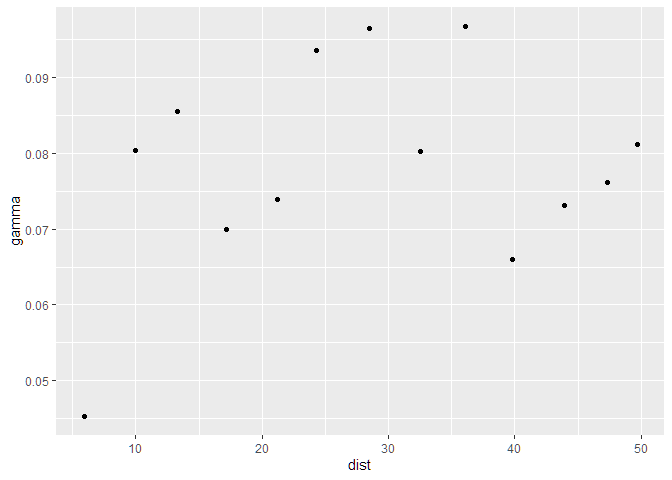<!-- -->

``` r
m_cor <- gstat::fit.variogram(vari_cor,
                              gstat::vgm(0.08,"Sph",60,0.03))
plot(vari_cor,model=m_cor, col=1,pl=F,pch=16)
```

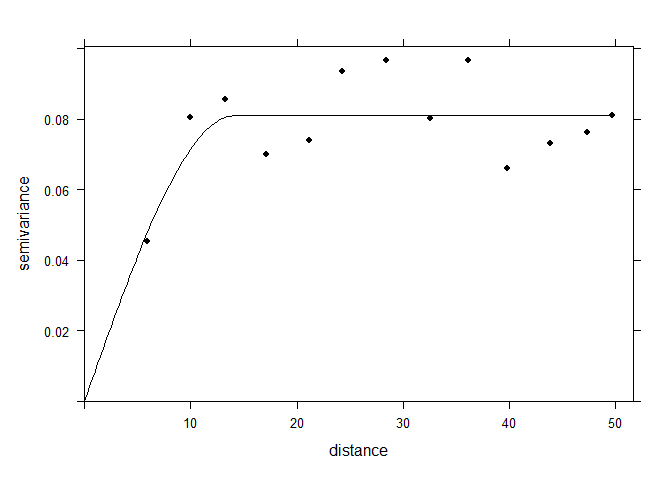<!-- -->

``` r
x <- data_set_cor %>% filter(cultura == "pasto") %>% drop_na() %>% pull(x)
y <- data_set_cor %>% filter(cultura == "pasto") %>% drop_na() %>% pull(y)
dis <- 1.5 # Distância entre pontos
grid <- expand.grid(X=seq(min(x),max(x),dis), Y=seq(min(y),max(y),dis))
sp::gridded(grid) = ~ X + Y
```

``` r
ko_cor_pt_xco2<-gstat::krige(formula=form, data_set_cor_pasto, grid, model=m_cor, 
    block=c(0,0),
    nsim=0,
    na.action=na.pass,
    debug.level=-1,  
    )
#> [using ordinary kriging]
#> 100% done
```

``` r
map_xco2 <- tibble::as.tibble(ko_cor_pt_xco2)  %>% 
  dplyr::mutate(flag = def_pol(X,Y,pasto_pol)) %>%  
  dplyr::filter(flag) %>% 
  ggplot2::ggplot(ggplot2::aes(x=X, y=Y)) + 
  ggplot2::geom_tile(ggplot2::aes(fill = var1.pred)) +
  ggplot2::scale_fill_viridis_c(option = "inferno")+
  ggplot2::coord_equal() +
  labs(fill="XCO2_cor")+
  theme_bw()
map_xco2
```

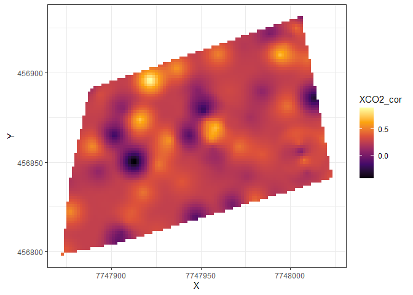<!-- -->

#### 

``` r
form <- cor_sif ~ 1
vari_cor <- gstat::variogram(form, data=data_set_cor_pasto,
                             cutoff=55,width=3.6,cressie=FALSE)
vari_cor  %>%
  ggplot(ggplot2::aes(x=dist, y=gamma)) +
  geom_point()
```

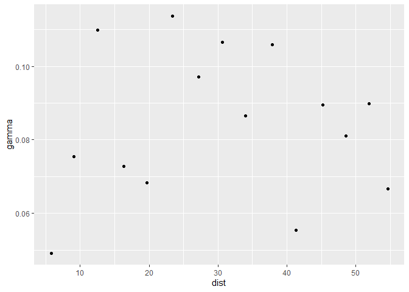<!-- -->

``` r
m_cor <- gstat::fit.variogram(vari_cor,
                              gstat::vgm(0.07,"Sph",20,0.02))
plot(vari_cor,model=m_cor, col=1,pl=F,pch=16)
```

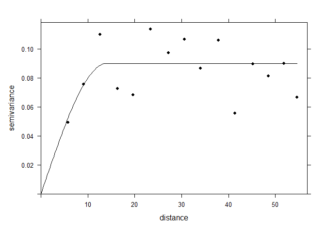<!-- -->

``` r
ko_cor_pt_sif<-gstat::krige(formula=form, data_set_cor_pasto, grid, model=m_cor,
    block=c(0,0),
    nsim=0,
    na.action=na.pass,
    debug.level=-1,
    )
#> [using ordinary kriging]
#> 100% done
```

``` r
map_sif <- tibble::as.tibble(ko_cor_pt_sif)  %>%
    dplyr::mutate(flag = def_pol(X,Y,pasto_pol)) %>%  
  dplyr::filter(flag) %>% 
  ggplot2::ggplot(ggplot2::aes(x=X, y=Y)) +
  ggplot2::geom_tile(ggplot2::aes(fill = var1.pred)) +
  ggplot2::scale_fill_viridis_c() +   
  ggplot2::coord_equal()+
  labs(fill="SIF_cor")+
  theme_bw()
map_sif
```

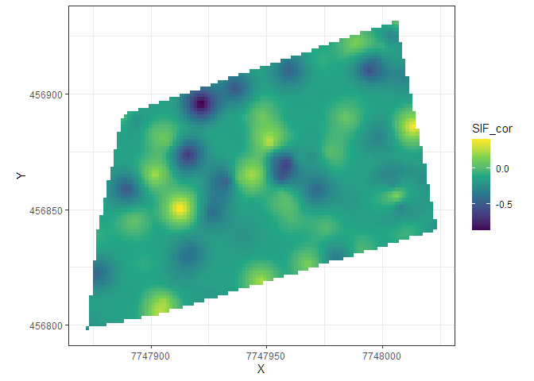<!-- -->

``` r
map_sif + map_xco2
```

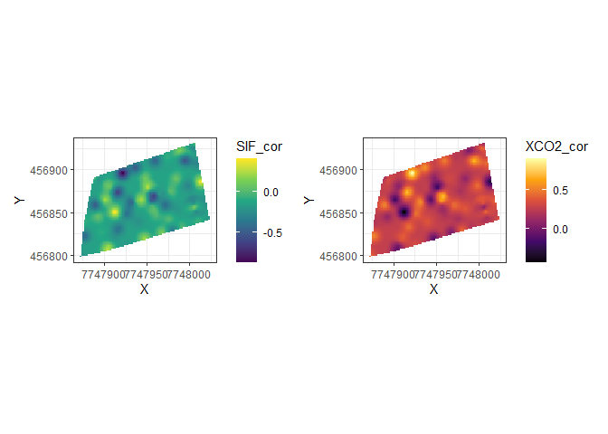<!-- --> \###
Correlação de mapas

``` r
cor_sif <- ko_cor_pt_sif |> as_tibble() |> pull(var1.pred)
cor_xco2 <- ko_cor_pt_xco2 |> as_tibble() |> pull(var1.pred)
cor.test(cor_sif,cor_xco2)
#> 
#>  Pearson's product-moment correlation
#> 
#> data:  cor_sif and cor_xco2
#> t = -430.15, df = 8987, p-value < 2.2e-16
#> alternative hypothesis: true correlation is not equal to 0
#> 95 percent confidence interval:
#>  -0.9775036 -0.9755877
#> sample estimates:
#>       cor 
#> -0.976565
```

## Análise geoestatística - Silvipastoril

``` r
data_set_cor_silvi <- data_set_cor %>% filter(cultura == "silvipastoril") %>% select(-cultura) %>% ungroup() %>% filter(row_number() <= n()-1)
sp::coordinates(data_set_cor_silvi)=~x+y  
form <- cor_xco2 ~ 1 
vari_cor <- gstat::variogram(form, data=data_set_cor_silvi,
                             cutoff=100,width=2.6,cressie=FALSE)
vari_cor  %>%  
  ggplot(ggplot2::aes(x=dist, y=gamma)) +
  geom_point()
```

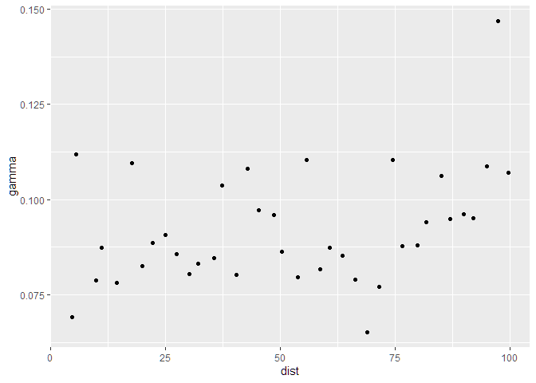<!-- -->

``` r
m_cor <- gstat::fit.variogram(vari_cor,
                              gstat::vgm(0.1,"Sph",40,0.01))
plot(vari_cor,model=m_cor, col=1,pl=F,pch=16)
```

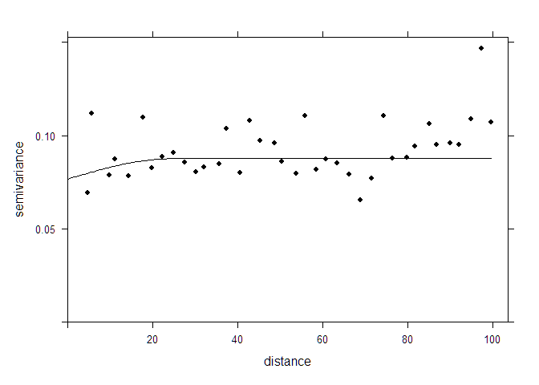<!-- -->

``` r
x <- data_set_cor %>% filter(cultura == "silvipastoril") %>% drop_na() %>% pull(x)
y <- data_set_cor %>% filter(cultura == "silvipastoril") %>% drop_na() %>% pull(y)
dis <- 1 #Distância entre pontos
grid <- expand.grid(X=seq(min(x),max(x),dis), Y=seq(min(y),max(y),dis))
sp::gridded(grid) = ~ X + Y
```

``` r
ko_cor_silv_xco2<-gstat::krige(formula=form, data_set_cor_silvi, grid, model=m_cor, 
    block=c(0,0),
    nsim=0,
    na.action=na.pass,
    debug.level=-1,  
    )
#> [using ordinary kriging]
#> 100% done
```

``` r
map_xco2 <- tibble::as.tibble(ko_cor_silv_xco2)  %>%  
    dplyr::mutate(flag = def_pol(X,Y,silv_pol)) %>%  
  dplyr::filter(flag) %>% 
  ggplot2::ggplot(ggplot2::aes(x=X, y=Y)) + 
  ggplot2::geom_tile(ggplot2::aes(fill = var1.pred)) +
  ggplot2::scale_fill_viridis_c(option = "inferno")+   
  ggplot2::coord_equal() +
  labs(fill="XCO2_cor") +
  theme_bw()
map_xco2
```

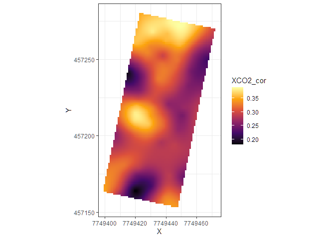<!-- -->

#### 

``` r
form <- cor_sif ~ 1
vari_cor <- gstat::variogram(form, data=data_set_cor_silvi,
                             cutoff=60,width=5,cressie=FALSE)
vari_cor  %>%
  ggplot(ggplot2::aes(x=dist, y=gamma)) +
  geom_point()
```

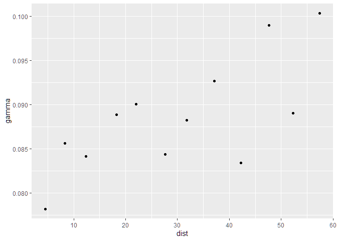<!-- -->

``` r
m_cor <- gstat::fit.variogram(vari_cor,
                              gstat::vgm(0.07,"Sph",20,0.04))
plot(vari_cor,model=m_cor, col=1,pl=F,pch=16)
```

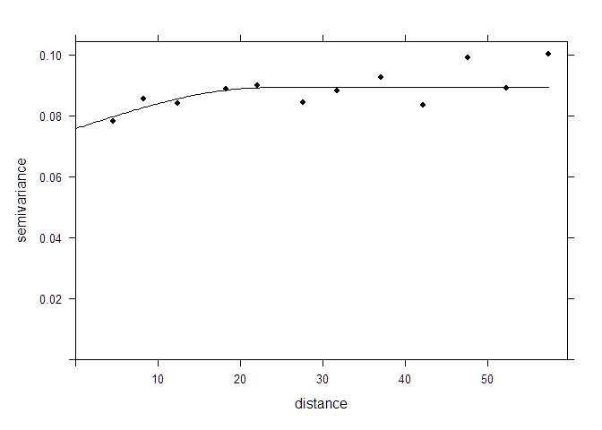<!-- -->

``` r
ko_cor_silv_sif<-gstat::krige(formula=form, data_set_cor_silvi, grid, model=m_cor,
    block=c(0,0),
    nsim=0,
    na.action=na.pass,
    debug.level=-1,
    )
#> [using ordinary kriging]
#>  61% done100% done
```

``` r
map_sif <- tibble::as.tibble(ko_cor_silv_sif)  %>%
    dplyr::mutate(flag = def_pol(X,Y,silv_pol)) %>%  
  dplyr::filter(flag) %>% 
  ggplot2::ggplot(ggplot2::aes(x=X, y=Y)) +
  ggplot2::geom_tile(ggplot2::aes(fill = var1.pred)) +
  ggplot2::scale_fill_viridis_c() +
  ggplot2::coord_equal()+
  theme_bw()+
  labs(fill="SIF_cor")
map_sif
```

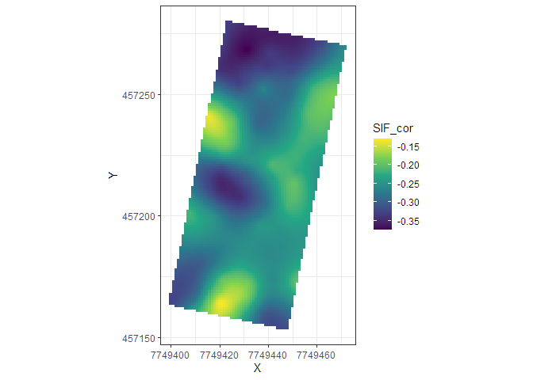<!-- -->

``` r
map_sif + map_xco2
```

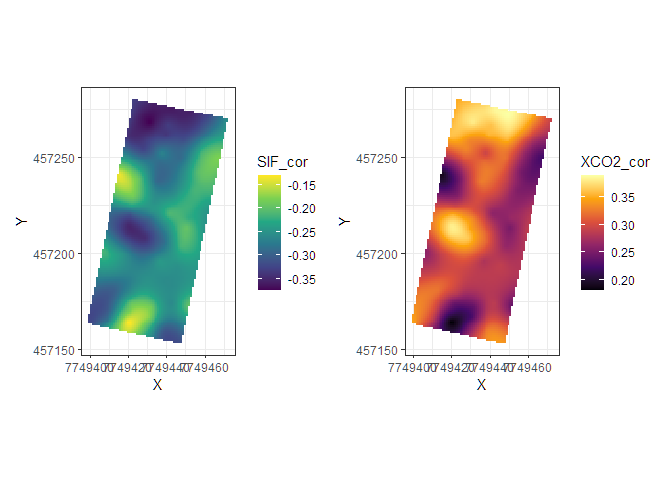<!-- -->

### Correlação de mapas de correlação

``` r
cor_sif <- ko_cor_silv_sif |> as_tibble() |> pull(var1.pred)
cor_xco2 <- ko_cor_silv_xco2 |> as_tibble() |> pull(var1.pred)
cor.test(cor_sif,cor_xco2)
#> 
#>  Pearson's product-moment correlation
#> 
#> data:  cor_sif and cor_xco2
#> t = -521.95, df = 9470, p-value < 2.2e-16
#> alternative hypothesis: true correlation is not equal to 0
#> 95 percent confidence interval:
#>  -0.9837233 -0.9823698
#> sample estimates:
#>        cor 
#> -0.9830599
```

### Aprendizado de Máquina - Modelo geral

``` r
data_set_temporal <- data_set |> 
  select(cultura, fco2:arg,tmed:inso,xco2,sif) |> 
  filter(fco2 <= 12) |> 
  ungroup() |> 
  drop_na()
```

``` r
 visdat::vis_miss(data_set_temporal) 
```

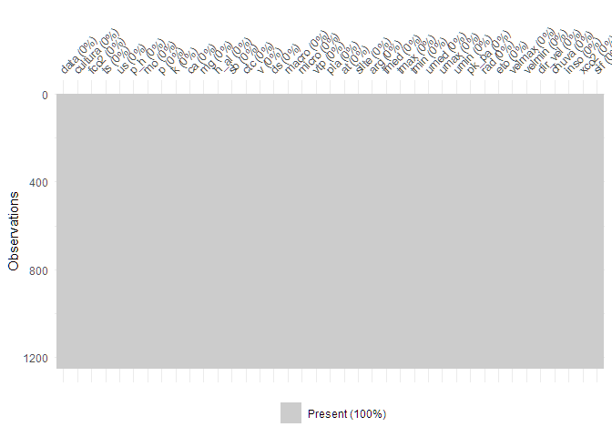<!-- --> \##
Definindo a Base de treino e teste

``` r
data_set_ml <- data_set_temporal %>% #<-------
  drop_na()
fco2_initial_split <- initial_split(data_set_ml, prop = 0.70)
```

``` r
fco2_train <- training(fco2_initial_split)
# fco2_test <- testing(fco2_initial_split)
# visdat::vis_miss(fco2_test)
fco2_train  %>% 
  ggplot(aes(x=fco2, y=..density..))+
  geom_histogram(bins = 30, color="black",  fill="lightgray")+
  geom_density(alpha=.05,fill="red")+
  theme_bw() +
  labs(x="fco2 - treino", y = "Densidade")
```

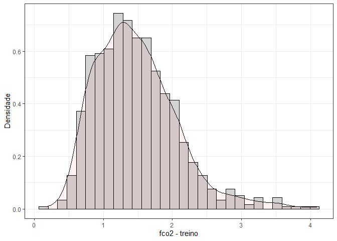<!-- -->

``` r
fco2_testing <- testing(fco2_initial_split)
fco2_testing  %>% 
  ggplot(aes(x=fco2, y=..density..))+
  geom_histogram(bins = 30, color="black",  fill="lightgray")+
  geom_density(alpha=.05,fill="blue")+
  theme_bw() +
  labs(x="fco2 - teste", y = "Densidade")
```

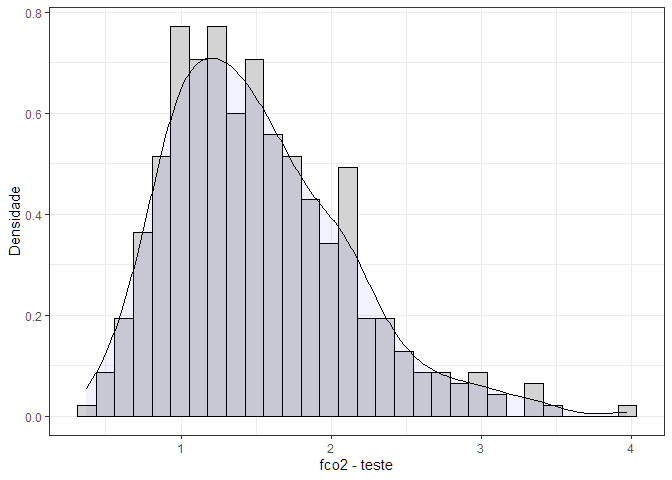<!-- -->

``` r
fco2_train   %>%    select(-c(data,cultura)) %>% 
  mutate(range_t = tmax-tmin) %>% 
  select(-c(tmax,tmin,umax,umin,dir_vel)) %>%   
  select(where(is.numeric)) %>%
  drop_na() %>% 
  cor()  %>%  
  corrplot::corrplot(method = "color",
         outline = T,,
         addgrid.col = "darkgray",cl.pos = "r", tl.col = "black",
         tl.cex = 1, cl.cex = 1, type = "upper", bg="azure2",
         diag = FALSE,
         addCoef.col = "black",
         cl.ratio = 0.2,
         cl.length = 5,
         number.cex = 0.3) 
```

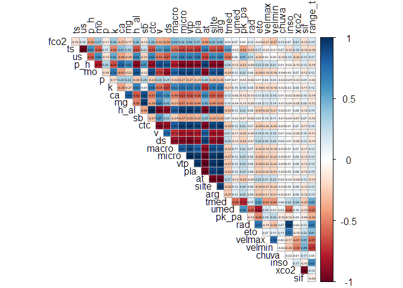<!-- -->

## Preparando os dados

``` r
fco2_train$cultura |> table()
#> 
#>         pasto silvipastoril 
#>           381           494

fco2_recipe <- recipe(fco2 ~ ., 
                      data = fco2_train %>% 
            select(-data) 
) %>%  
  step_normalize(all_numeric_predictors())  %>% 
  step_naomit() %>%  
  step_novel(all_nominal_predictors()) %>% 
  step_zv(all_predictors()) %>%
  step_naomit(c(ts, us)) %>% 
  step_impute_median(where(is.numeric)) # %>%  inputação da mediana nos numéricos
  # step_poly(c(Us,Ts), degree = 2)  %>%  
  # step_dummy(all_nominal_predictors()) 
bake(prep(fco2_recipe), new_data = NULL)
#> # A tibble: 875 × 38
#>    cultura         ts     us    p_h      mo      p       k     ca      mg   h_al
#>    <fct>        <dbl>  <dbl>  <dbl>   <dbl>  <dbl>   <dbl>  <dbl>   <dbl>  <dbl>
#>  1 silvipasto… -1.30   1.29  -0.786  0.205  -0.654  0.415  -0.496 -0.349   0.643
#>  2 pasto        0.611 -0.593  1.23  -1.11   -0.900  0.124   0.575  0.996  -1.12 
#>  3 silvipasto… -0.592  0.591 -0.988  0.789  -0.408  0.415  -1.21  -1.02    1.16 
#>  4 pasto        0.826 -0.805  0.423 -0.963  -0.900 -0.810   0.932 -0.0128 -0.924
#>  5 pasto        1.04  -1.02   0.423 -0.963   1.31  -0.576  -0.139 -0.0128 -0.924
#>  6 silvipasto… -1.46   1.44  -0.988  0.205  -0.654  1.06   -1.21  -1.36    0.871
#>  7 silvipasto… -0.284  0.287 -0.988  1.37   -0.162  0.0652 -0.496 -0.349   0.871
#>  8 pasto        0.487 -0.471  1.43  -0.379  -0.162 -0.868   1.65   1.33   -1.07 
#>  9 silvipasto… -1.37   1.36  -0.988  0.205  -0.654  0.357  -1.21  -1.69    1.16 
#> 10 pasto        0.950 -0.926  1.03  -0.0869  0.576 -0.926   1.65   0.660  -0.924
#> # ℹ 865 more rows
#> # ℹ 28 more variables: sb <dbl>, ctc <dbl>, v <dbl>, ds <dbl>, macro <dbl>,
#> #   micro <dbl>, vtp <dbl>, pla <dbl>, at <dbl>, silte <dbl>, arg <dbl>,
#> #   tmed <dbl>, tmax <dbl>, tmin <dbl>, umed <dbl>, umax <dbl>, umin <dbl>,
#> #   pk_pa <dbl>, rad <dbl>, eto <dbl>, velmax <dbl>, velmin <dbl>,
#> #   dir_vel <dbl>, chuva <dbl>, inso <dbl>, xco2 <dbl>, sif <dbl>, fco2 <dbl>
```

## Reamostragem

``` r
fco2_resamples <- vfold_cv(fco2_train, v = 5) 
```

## Random Forest

``` r
fco2_rf_model <- rand_forest(
  min_n = tune(),
  mtry = tune(),
  trees = tune()
)   %>%  
  set_mode("regression")  %>% 
  set_engine("randomForest")
```

### Workflow

``` r
fco2_rf_wf <- workflow()   %>%  
  add_model(fco2_rf_model) %>%  
  add_recipe(fco2_recipe)
```

### Tune

``` r
grid_rf <- grid_regular(
  min_n(range = c(2, 10)),
  mtry(range = c(3, 10)), 
  trees(range = c(50, 500)),
  levels = c(3, 3, 3)
)

fco2_rf_tune_grid <- tune_grid(
 fco2_rf_wf,
  resamples = fco2_resamples,
  grid = grid_rf,
  metrics = metric_set(rmse)
)
```

``` r
autoplot(fco2_rf_tune_grid) + 
  theme_bw()
```

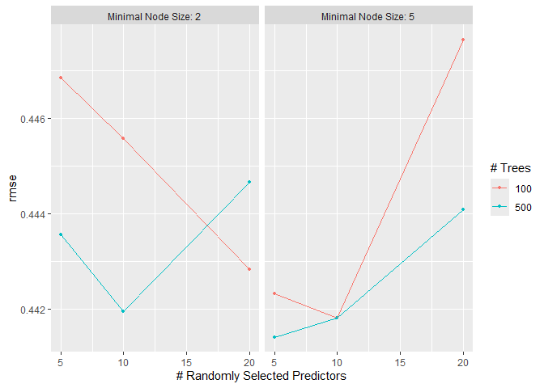<!-- -->

``` r
collect_metrics(fco2_rf_tune_grid)
#> # A tibble: 27 × 9
#>     mtry trees min_n .metric .estimator  mean     n std_err .config             
#>    <int> <int> <int> <chr>   <chr>      <dbl> <int>   <dbl> <chr>               
#>  1     3    50     2 rmse    standard   0.449     5  0.0218 Preprocessor1_Model…
#>  2     3    50     6 rmse    standard   0.452     5  0.0204 Preprocessor1_Model…
#>  3     3    50    10 rmse    standard   0.448     5  0.0175 Preprocessor1_Model…
#>  4     6    50     2 rmse    standard   0.438     5  0.0192 Preprocessor1_Model…
#>  5     6    50     6 rmse    standard   0.442     5  0.0201 Preprocessor1_Model…
#>  6     6    50    10 rmse    standard   0.434     5  0.0184 Preprocessor1_Model…
#>  7    10    50     2 rmse    standard   0.440     5  0.0202 Preprocessor1_Model…
#>  8    10    50     6 rmse    standard   0.438     5  0.0174 Preprocessor1_Model…
#>  9    10    50    10 rmse    standard   0.437     5  0.0175 Preprocessor1_Model…
#> 10     3   275     2 rmse    standard   0.443     5  0.0197 Preprocessor1_Model…
#> # ℹ 17 more rows
fco2_rf_tune_grid %>%
  show_best(metric = "rmse", n = 6)
#> # A tibble: 6 × 9
#>    mtry trees min_n .metric .estimator  mean     n std_err .config              
#>   <int> <int> <int> <chr>   <chr>      <dbl> <int>   <dbl> <chr>                
#> 1    10   500    10 rmse    standard   0.433     5  0.0175 Preprocessor1_Model27
#> 2    10   500     6 rmse    standard   0.433     5  0.0176 Preprocessor1_Model26
#> 3     6    50    10 rmse    standard   0.434     5  0.0184 Preprocessor1_Model06
#> 4    10   275     6 rmse    standard   0.435     5  0.0172 Preprocessor1_Model17
#> 5    10   275     2 rmse    standard   0.435     5  0.0171 Preprocessor1_Model16
#> 6    10   500     2 rmse    standard   0.435     5  0.0179 Preprocessor1_Model25
```

### Desempenho modelo final

``` r
fco2_rf_best_params <- select_best(fco2_rf_tune_grid, metric = "rmse")
fco2_rf_wf <- fco2_rf_wf %>%
  finalize_workflow(fco2_rf_best_params)
fco2_rf_last_fit <- last_fit(fco2_rf_wf, fco2_initial_split)

## Criando os preditos
fco2_test_preds <- bind_rows(
  collect_predictions(fco2_rf_last_fit)  %>%
    mutate(modelo = "rf"))

fco2_test <- testing(fco2_initial_split)

fco2_test_preds %>%
  ggplot(aes(x=.pred, y=fco2)) +
  geom_point()+
  theme_bw() +
  geom_smooth(method = "lm") +
  stat_regline_equation(ggplot2::aes(
  label =  paste(..eq.label.., ..rr.label.., sep = "*plain(\",\")~~"))) +
  geom_abline (slope=1, linetype = "dashed", color="Red")
```

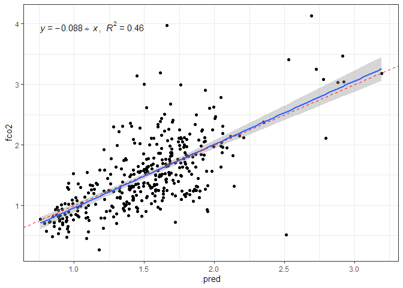<!-- -->

``` r
fco2_rf_last_fit_model <-fco2_rf_last_fit$.workflow[[1]]$fit$fit
vip(fco2_rf_last_fit_model,
    aesthetics = list(color = "black", fill = "orange")) +
    theme(axis.text.y=element_text(size=rel(1.5)),
          axis.text.x=element_text(size=rel(1.5)),
          axis.title.x=element_text(size=rel(1.5))
          ) +
  theme_bw()
```

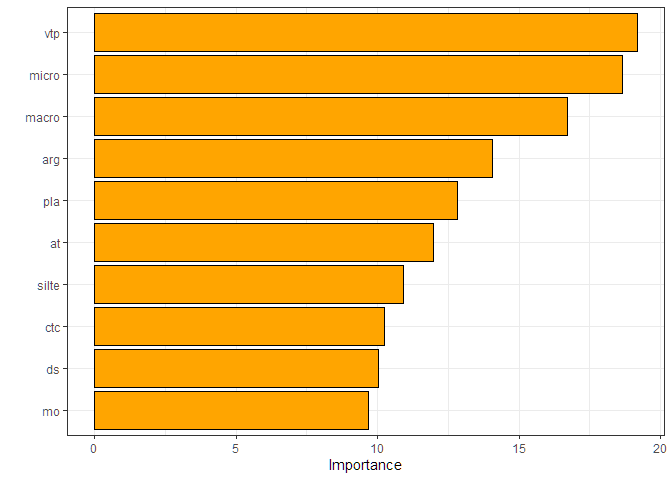<!-- --> \###
Aprendizado de Máquina - Modelo Silvipastoril

``` r
data_set_temporal <- data_set |> 
  filter(cultura == "silvipastoril") |> 
  select(fco2:arg,tmed:inso,xco2,sif) |> 
  filter(fco2 <= 12) |> 
  ungroup() |> 
  drop_na()
```

``` r
 visdat::vis_miss(data_set_temporal) 
```

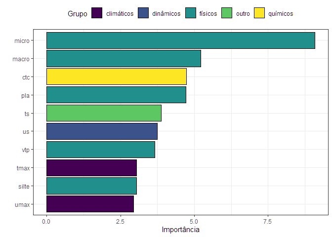<!-- --> \##
Definindo a Base de treino e teste

``` r
data_set_ml <- data_set_temporal %>% #<-------
  drop_na()
fco2_initial_split <- initial_split(data_set_ml, prop = 0.70)
```

``` r
fco2_train <- training(fco2_initial_split)
# fco2_test <- testing(fco2_initial_split)
# visdat::vis_miss(fco2_test)
fco2_train  %>% 
  ggplot(aes(x=fco2, y=..density..))+
  geom_histogram(bins = 30, color="black",  fill="lightgray")+
  geom_density(alpha=.05,fill="red")+
  theme_bw() +
  labs(x="fco2 - treino", y = "Densidade")
```

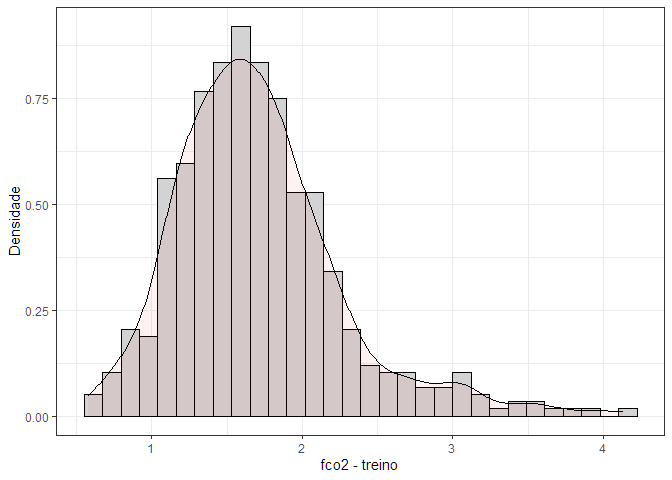<!-- -->

``` r
fco2_testing <- testing(fco2_initial_split)
fco2_testing  %>% 
  ggplot(aes(x=fco2, y=..density..))+
  geom_histogram(bins = 30, color="black",  fill="lightgray")+
  geom_density(alpha=.05,fill="blue")+
  theme_bw() +
  labs(x="fco2 - teste", y = "Densidade")
```

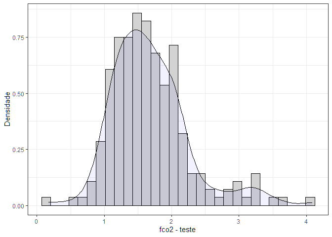<!-- -->

``` r
fco2_train   %>%    select(-c(data,cultura)) %>% 
  mutate(range_t = tmax-tmin) %>% 
  select(-c(tmax,tmin,umax,umin,dir_vel)) %>%   
  select(where(is.numeric)) %>%
  drop_na() %>% 
  cor()  %>%  
  corrplot::corrplot(method = "color",
         outline = T,,
         addgrid.col = "darkgray",cl.pos = "r", tl.col = "black",
         tl.cex = 1, cl.cex = 1, type = "upper", bg="azure2",
         diag = FALSE,
         addCoef.col = "black",
         cl.ratio = 0.2,
         cl.length = 5,
         number.cex = 0.3) 
```

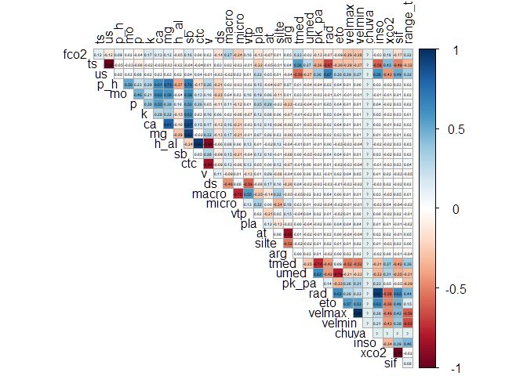<!-- -->

## Preparando os dados

``` r
fco2_train$cultura |> table()
#> 
#> silvipastoril 
#>           480

fco2_recipe <- recipe(fco2 ~ ., 
                      data = fco2_train %>% 
            select(-c(data,cultura,chuva) )
) %>%  
  step_normalize(all_numeric_predictors())  %>% 
  step_naomit() %>%  
  step_novel(all_nominal_predictors()) %>% 
  step_zv(all_predictors()) %>%
  step_naomit(c(ts, us)) %>% 
  step_impute_median(where(is.numeric)) # %>%  inputação da mediana nos numéricos
  # step_poly(c(Us,Ts), degree = 2)  %>%  
  # step_dummy(all_nominal_predictors()) 
bake(prep(fco2_recipe), new_data = NULL)
#> # A tibble: 480 × 36
#>        ts     us     p_h      mo      p       k     ca      mg   h_al     sb
#>     <dbl>  <dbl>   <dbl>   <dbl>  <dbl>   <dbl>  <dbl>   <dbl>  <dbl>  <dbl>
#>  1 -0.156  0.156 -0.905  -0.0355 -1.17  -0.463  -1.21  -1.21    0.753 -1.21 
#>  2 -0.223  0.223  0.0712 -0.0355 -0.486 -0.904  -0.571  0.0691 -0.395 -0.481
#>  3 -0.464  0.464  1.05   -1.80    0.194  0.420   1.34   2.19   -0.904  1.76 
#>  4 -0.556  0.556  0.0712  0.847   2.23   0.0419 -0.571 -0.356   0.753 -0.370
#>  5  0.143 -0.143 -0.905  -0.624  -0.486 -0.778  -0.571 -0.356   0.753 -0.658
#>  6  0.343 -0.343 -0.905  -1.21   -1.17  -0.778  -1.21  -1.21    0.753 -1.32 
#>  7 -0.656  0.656  1.05    0.847   0.874 -0.778   0.706  0.494   0.115  0.230
#>  8  1.31  -1.31   1.05   -0.0355 -1.17  -0.589   0.706  0.494  -0.904  0.296
#>  9 -0.256  0.256  0.0712 -0.330  -0.486  0.546  -0.571 -0.356   0.115 -0.192
#> 10  1.91  -1.91  -0.905  -0.624  -0.486 -1.03   -0.571 -0.356   0.115 -0.747
#> # ℹ 470 more rows
#> # ℹ 26 more variables: ctc <dbl>, v <dbl>, ds <dbl>, macro <dbl>, micro <dbl>,
#> #   vtp <dbl>, pla <dbl>, at <dbl>, silte <dbl>, arg <dbl>, tmed <dbl>,
#> #   tmax <dbl>, tmin <dbl>, umed <dbl>, umax <dbl>, umin <dbl>, pk_pa <dbl>,
#> #   rad <dbl>, eto <dbl>, velmax <dbl>, velmin <dbl>, dir_vel <dbl>,
#> #   inso <dbl>, xco2 <dbl>, sif <dbl>, fco2 <dbl>
```

## Random Forest

``` r
fco2_rf_model <- rand_forest(
  min_n = tune(),
  mtry = tune(),
  trees = tune()
)   %>%  
  set_mode("regression")  %>% 
  set_engine("randomForest")
```

### Workflow

``` r
fco2_rf_wf <- workflow()   %>%  
  add_model(fco2_rf_model) %>%  
  add_recipe(fco2_recipe)
```

### Tune

``` r
grid_rf <- grid_regular(
  min_n(range = c(2, 10)),
  mtry(range = c(3, 10)), 
  trees(range = c(50, 500)),
  levels = c(3, 3, 3)
)

fco2_rf_tune_grid <- tune_grid(
 fco2_rf_wf,
  resamples = fco2_resamples,
  grid = grid_rf,
  metrics = metric_set(rmse)
)
```

``` r
autoplot(fco2_rf_tune_grid) +
  theme_bw()
```

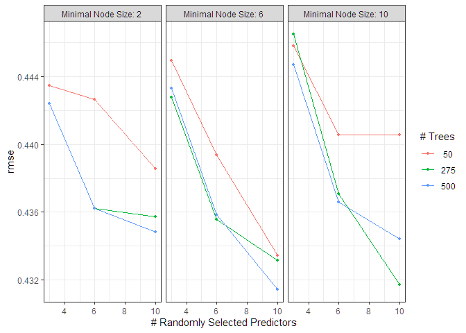<!-- -->

``` r
collect_metrics(fco2_rf_tune_grid)
#> # A tibble: 27 × 9
#>     mtry trees min_n .metric .estimator  mean     n std_err .config             
#>    <int> <int> <int> <chr>   <chr>      <dbl> <int>   <dbl> <chr>               
#>  1     3    50     2 rmse    standard   0.443     5  0.0203 Preprocessor1_Model…
#>  2     3    50     6 rmse    standard   0.445     5  0.0196 Preprocessor1_Model…
#>  3     3    50    10 rmse    standard   0.446     5  0.0191 Preprocessor1_Model…
#>  4     6    50     2 rmse    standard   0.443     5  0.0193 Preprocessor1_Model…
#>  5     6    50     6 rmse    standard   0.439     5  0.0169 Preprocessor1_Model…
#>  6     6    50    10 rmse    standard   0.441     5  0.0194 Preprocessor1_Model…
#>  7    10    50     2 rmse    standard   0.439     5  0.0174 Preprocessor1_Model…
#>  8    10    50     6 rmse    standard   0.433     5  0.0171 Preprocessor1_Model…
#>  9    10    50    10 rmse    standard   0.441     5  0.0174 Preprocessor1_Model…
#> 10     3   275     2 rmse    standard   0.442     5  0.0195 Preprocessor1_Model…
#> # ℹ 17 more rows
fco2_rf_tune_grid %>%
  show_best(metric = "rmse", n = 6)
#> # A tibble: 6 × 9
#>    mtry trees min_n .metric .estimator  mean     n std_err .config              
#>   <int> <int> <int> <chr>   <chr>      <dbl> <int>   <dbl> <chr>                
#> 1    10   500     6 rmse    standard   0.431     5  0.0168 Preprocessor1_Model26
#> 2    10   275    10 rmse    standard   0.432     5  0.0169 Preprocessor1_Model18
#> 3    10   275     6 rmse    standard   0.433     5  0.0178 Preprocessor1_Model17
#> 4    10    50     6 rmse    standard   0.433     5  0.0171 Preprocessor1_Model08
#> 5    10   500    10 rmse    standard   0.434     5  0.0174 Preprocessor1_Model27
#> 6    10   500     2 rmse    standard   0.435     5  0.0178 Preprocessor1_Model25
```

### Desempenho modelo final

``` r
fco2_rf_best_params <- select_best(fco2_rf_tune_grid, metric = "rmse")
fco2_rf_wf <- fco2_rf_wf %>%
  finalize_workflow(fco2_rf_best_params)
fco2_rf_last_fit <- last_fit(fco2_rf_wf, fco2_initial_split)

## Criando os preditos
fco2_test_preds <- bind_rows(
  collect_predictions(fco2_rf_last_fit)  %>%
    mutate(modelo = "rf"))

fco2_test <- testing(fco2_initial_split)

fco2_test_preds %>%
  ggplot(aes(x=.pred, y=fco2)) +
  geom_point()+
  theme_bw() +
  geom_smooth(method = "lm") +
  stat_regline_equation(ggplot2::aes(
  label =  paste(..eq.label.., ..rr.label.., sep = "*plain(\",\")~~"))) +
  geom_abline (slope=1, linetype = "dashed", color="Red")
```

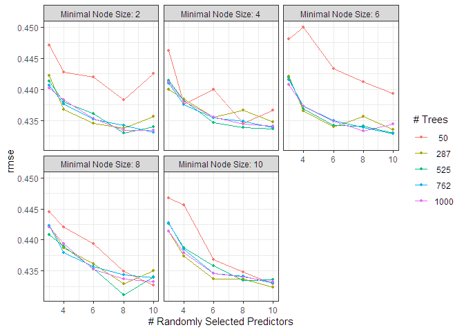<!-- -->

``` r
fco2_rf_last_fit_model <-fco2_rf_last_fit$.workflow[[1]]$fit$fit
vip(fco2_rf_last_fit_model,
    aesthetics = list(color = "black", fill = "orange")) +
    theme(axis.text.y=element_text(size=rel(1.5)),
          axis.text.x=element_text(size=rel(1.5)),
          axis.title.x=element_text(size=rel(1.5))
          ) +
  theme_bw()
```

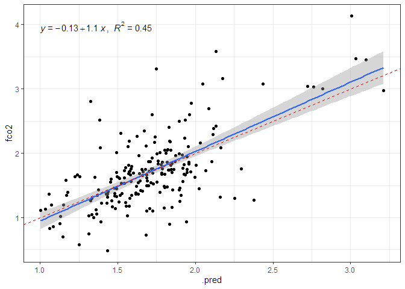<!-- -->

### Aprendizado de Máquina - Modelo pasto

``` r
data_set_temporal <- data_set |> 
  filter(cultura == "pasto") |> 
  select(fco2:arg,tmed:inso,xco2,sif) |> 
  filter(fco2 <= 12) |> 
  ungroup() |> 
  drop_na()
```

``` r
visdat::vis_miss(data_set_temporal) 
```

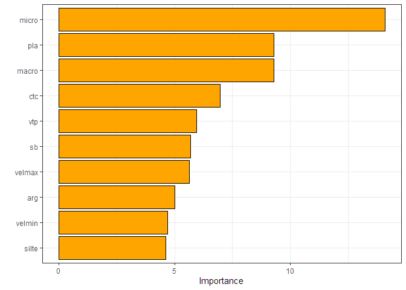<!-- --> \##
Definindo a Base de treino e teste

``` r
data_set_ml <- data_set_temporal %>% #<-------
  drop_na()
fco2_initial_split <- initial_split(data_set_ml, prop = 0.70)
```

``` r
fco2_train <- training(fco2_initial_split)
# fco2_test <- testing(fco2_initial_split)
# visdat::vis_miss(fco2_test)
fco2_train  %>% 
  ggplot(aes(x=fco2, y=..density..))+
  geom_histogram(bins = 30, color="black",  fill="lightgray")+
  geom_density(alpha=.05,fill="red")+
  theme_bw() +
  labs(x="fco2 - treino", y = "Densidade")
```

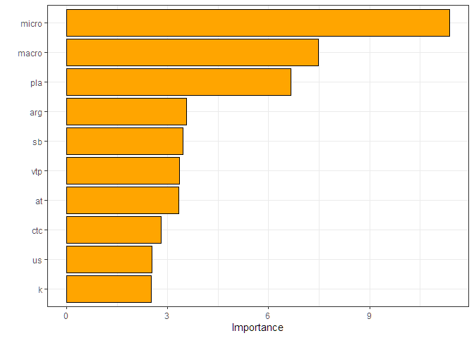<!-- -->

``` r
fco2_testing <- testing(fco2_initial_split)
fco2_testing  %>% 
  ggplot(aes(x=fco2, y=..density..))+
  geom_histogram(bins = 30, color="black",  fill="lightgray")+
  geom_density(alpha=.05,fill="blue")+
  theme_bw() +
  labs(x="fco2 - teste", y = "Densidade")
```

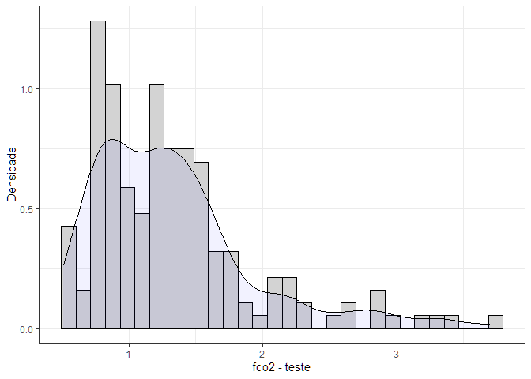<!-- -->

``` r
fco2_train   %>%    select(-c(data,cultura)) %>% 
  mutate(range_t = tmax-tmin) %>% 
  select(-c(tmax,tmin,umax,umin,dir_vel)) %>%   
  select(where(is.numeric)) %>%
  drop_na() %>% 
  cor()  %>%  
  corrplot::corrplot(method = "color",
         outline = T,,
         addgrid.col = "darkgray",cl.pos = "r", tl.col = "black",
         tl.cex = 1, cl.cex = 1, type = "upper", bg="azure2",
         diag = FALSE,
         addCoef.col = "black",
         cl.ratio = 0.2,
         cl.length = 5,
         number.cex = 0.3) 
```

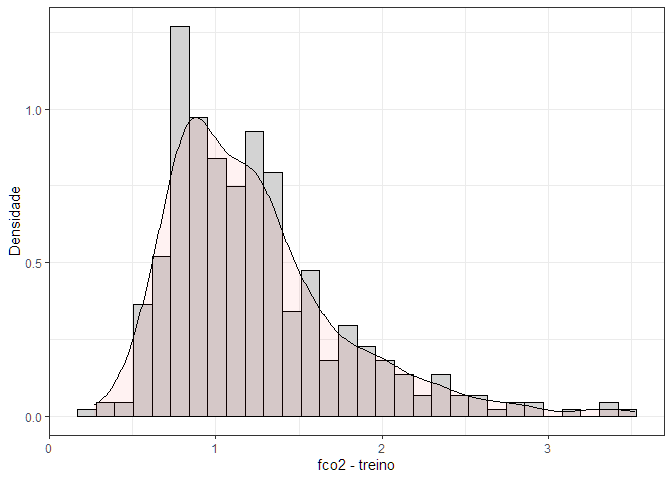<!-- -->

## Preparando os dados

``` r
fco2_recipe <- recipe(fco2 ~ ., 
                      data = fco2_train %>% 
            select(-c(data,cultura,chuva)) 
) %>%  
  step_normalize(all_numeric_predictors())  %>% 
  step_naomit() %>%  
  step_novel(all_nominal_predictors()) %>% 
  step_zv(all_predictors()) %>%
  step_naomit(c(ts, us)) %>% 
  step_impute_median(where(is.numeric)) # %>%  inputação da mediana nos numéricos
  # step_poly(c(Us,Ts), degree = 2)  %>%  
  # step_dummy(all_nominal_predictors()) 
bake(prep(fco2_recipe), new_data = NULL)
#> # A tibble: 394 × 36
#>         ts      us    p_h     mo      p       k     ca     mg     h_al     sb
#>      <dbl>   <dbl>  <dbl>  <dbl>  <dbl>   <dbl>  <dbl>  <dbl>    <dbl>  <dbl>
#>  1  0.340  -0.253   2.95   0.501 -0.519  0.457   3.07   2.49  -2.27     2.93 
#>  2 -0.418   0.429   0.693  0.886 -0.160  0.0190  1.64   1.81  -0.571    1.80 
#>  3  0.340  -0.253   0.693  1.65  -0.339 -0.200   0.918  0.781 -0.00593  0.867
#>  4  0.0133  0.0410  0.693 -0.653 -0.879  3.97   -0.877 -0.244 -1.14    -0.246
#>  5  0.321  -0.236   0.316 -0.268  0.919  0.0190 -0.877 -0.586 -1.14    -0.757
#>  6 -0.972   0.928  -0.815 -0.653 -0.160 -0.420  -0.877 -0.927  1.41    -0.976
#>  7 -0.480   0.485   0.316  0.501 -0.519 -0.420  -0.159  1.81  -0.00593  0.849
#>  8 -0.356   0.374  -0.438 -0.653  1.64   0.0190 -0.877 -0.586 -0.00593 -0.757
#>  9 -0.788   0.762  -1.19  -0.653 -0.879 -0.200  -0.518 -0.927  1.41    -0.775
#> 10 -0.172   0.207   1.56   0.597  1.05  -0.200   1.37   1.12  -1.06     1.28 
#> # ℹ 384 more rows
#> # ℹ 26 more variables: ctc <dbl>, v <dbl>, ds <dbl>, macro <dbl>, micro <dbl>,
#> #   vtp <dbl>, pla <dbl>, at <dbl>, silte <dbl>, arg <dbl>, tmed <dbl>,
#> #   tmax <dbl>, tmin <dbl>, umed <dbl>, umax <dbl>, umin <dbl>, pk_pa <dbl>,
#> #   rad <dbl>, eto <dbl>, velmax <dbl>, velmin <dbl>, dir_vel <dbl>,
#> #   inso <dbl>, xco2 <dbl>, sif <dbl>, fco2 <dbl>
```

## Random Forest

``` r
fco2_rf_model <- rand_forest(
  min_n = tune(),
  mtry = tune(),
  trees = tune()
)   %>%  
  set_mode("regression")  %>% 
  set_engine("randomForest")
```

### Workflow

``` r
fco2_rf_wf <- workflow()   %>%  
  add_model(fco2_rf_model) %>%  
  add_recipe(fco2_recipe)
```

### Tune

``` r
grid_rf <- grid_regular(
  min_n(range = c(2, 10)),
  mtry(range = c(3, 10)), 
  trees(range = c(50, 500)),
  levels = c(3, 3, 3)
)

fco2_rf_tune_grid <- tune_grid(
 fco2_rf_wf,
  resamples = fco2_resamples,
  grid = grid_rf,
  metrics = metric_set(rmse)
)
```

``` r
autoplot(fco2_rf_tune_grid)
```

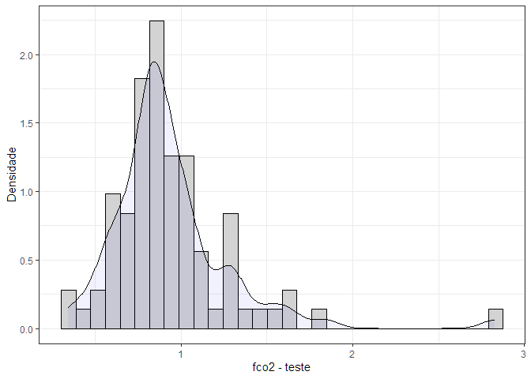<!-- -->

``` r
collect_metrics(fco2_rf_tune_grid)
#> # A tibble: 27 × 9
#>     mtry trees min_n .metric .estimator  mean     n std_err .config             
#>    <int> <int> <int> <chr>   <chr>      <dbl> <int>   <dbl> <chr>               
#>  1     3    50     2 rmse    standard   0.448     5  0.0193 Preprocessor1_Model…
#>  2     3    50     6 rmse    standard   0.445     5  0.0210 Preprocessor1_Model…
#>  3     3    50    10 rmse    standard   0.449     5  0.0186 Preprocessor1_Model…
#>  4     6    50     2 rmse    standard   0.437     5  0.0179 Preprocessor1_Model…
#>  5     6    50     6 rmse    standard   0.437     5  0.0164 Preprocessor1_Model…
#>  6     6    50    10 rmse    standard   0.442     5  0.0186 Preprocessor1_Model…
#>  7    10    50     2 rmse    standard   0.441     5  0.0185 Preprocessor1_Model…
#>  8    10    50     6 rmse    standard   0.441     5  0.0168 Preprocessor1_Model…
#>  9    10    50    10 rmse    standard   0.432     5  0.0171 Preprocessor1_Model…
#> 10     3   275     2 rmse    standard   0.444     5  0.0186 Preprocessor1_Model…
#> # ℹ 17 more rows
fco2_rf_tune_grid %>%
  show_best(metric = "rmse", n = 6)
#> # A tibble: 6 × 9
#>    mtry trees min_n .metric .estimator  mean     n std_err .config              
#>   <int> <int> <int> <chr>   <chr>      <dbl> <int>   <dbl> <chr>                
#> 1    10    50    10 rmse    standard   0.432     5  0.0171 Preprocessor1_Model09
#> 2    10   500    10 rmse    standard   0.432     5  0.0170 Preprocessor1_Model27
#> 3    10   275     6 rmse    standard   0.434     5  0.0169 Preprocessor1_Model17
#> 4    10   275     2 rmse    standard   0.435     5  0.0174 Preprocessor1_Model16
#> 5    10   500     6 rmse    standard   0.435     5  0.0177 Preprocessor1_Model26
#> 6     6   500     6 rmse    standard   0.435     5  0.0184 Preprocessor1_Model23
```

### Desempenho modelo final

``` r
fco2_rf_best_params <- select_best(fco2_rf_tune_grid, metric = "rmse")
fco2_rf_wf <- fco2_rf_wf %>%
  finalize_workflow(fco2_rf_best_params)
fco2_rf_last_fit <- last_fit(fco2_rf_wf, fco2_initial_split)

## Criando os preditos
fco2_test_preds <- bind_rows(
  collect_predictions(fco2_rf_last_fit)  %>%
    mutate(modelo = "rf"))

fco2_test <- testing(fco2_initial_split)

fco2_test_preds %>%
  ggplot(aes(x=.pred, y=fco2)) +
  geom_point()+
  theme_bw() +
  geom_smooth(method = "lm") +
  stat_regline_equation(ggplot2::aes(
  label =  paste(..eq.label.., ..rr.label.., sep = "*plain(\",\")~~"))) +
  geom_abline (slope=1, linetype = "dashed", color="Red")
```

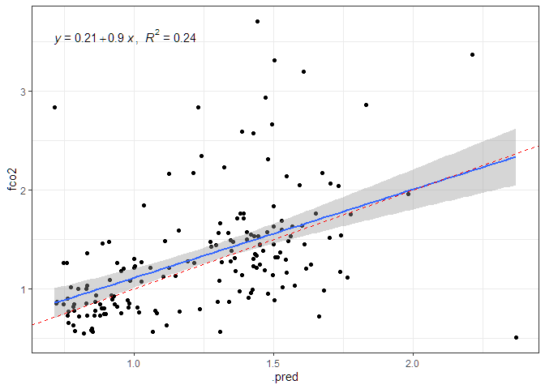<!-- -->

``` r
fco2_rf_last_fit_model <-fco2_rf_last_fit$.workflow[[1]]$fit$fit
vip(fco2_rf_last_fit_model,
    aesthetics = list(color = "black", fill = "orange")) +
    theme(axis.text.y=element_text(size=rel(1.5)),
          axis.text.x=element_text(size=rel(1.5)),
          axis.title.x=element_text(size=rel(1.5))
          ) +
  theme_bw()
```

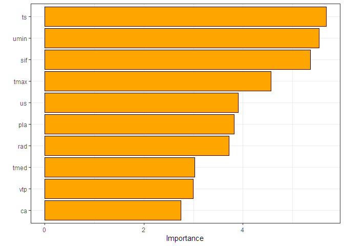<!-- -->
