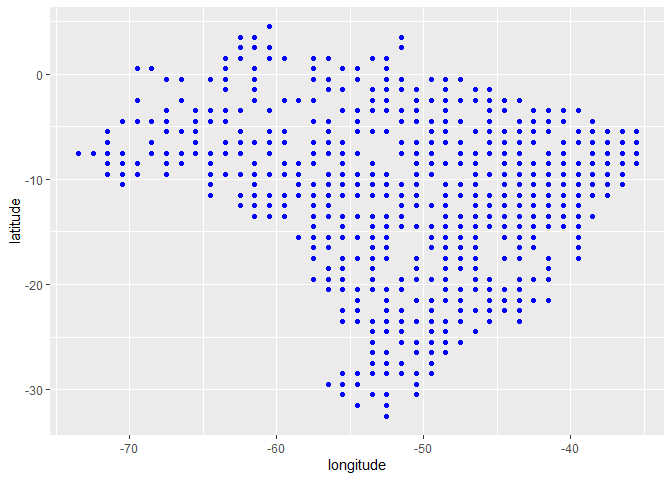
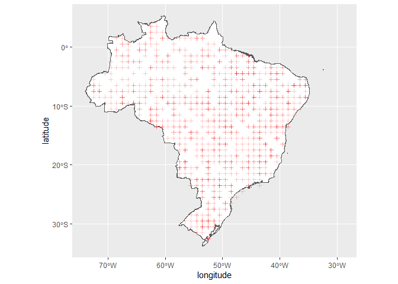
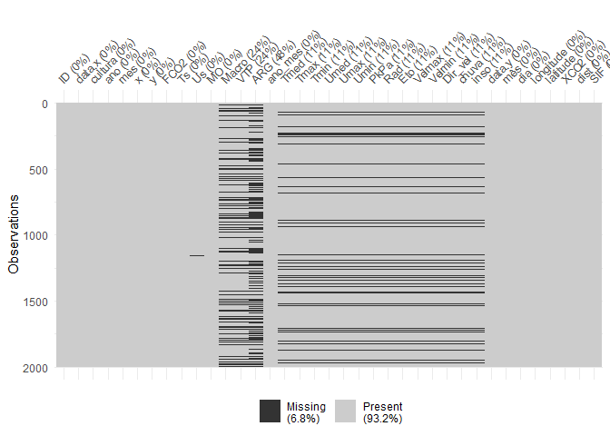

MODELAGEM COMPUTACIONAL DA EMISSÃO DE CO2 DO SOLO EM ÁREAS DE PASTAGEM
DEGRADADAS E MANEJO SILVIPASTORIL NO CERRADO BRASILEIRO
================

#### *Zanini, E. L.; Panosso, A. R.;*

##### Financiamento:…

<!-- README.md is generated from README.Rmd. Please edit that file -->

## Resumo do Trabalho

### Aquisição dos dados de CO<sub>2</sub> atmosférico (xCO2)

A aquisição de dados de X<sub>co2</sub> e SIF, e seus processamentos
iniciais pode ser encontrados no link:

#### <https://arpanosso.github.io/oco2/>

Para facilitar o acesso, os dodos foram adquiridos por meio do pacote
`{fco2}`.

``` r
## Instalando pacotes (se necessário)
# install.packages("devtools")
# Sys.getenv("GITHUB_PAT")
# Sys.unsetenv("GITHUB_PAT")
# Sys.getenv("GITHUB_PAT")
# devtools::install_github("arpanosso/fco2r")
library(readxl)
library(tidyverse)
library(geobr)
library(fco2r)
library(skimr)
library(tidymodels)
library(ISLR)
library(modeldata)
library(vip)
library(ggpubr)
source("R/my_fun.R")

# Definindo o plano de multisession
future::plan("multisession")
```

### Carregando os dados meteorológicos

``` r
dados_estacao <- read_excel("data-raw/xlsx/estacao_meteorologia_ilha_solteira.xlsx", na = "NA") 
glimpse(dados_estacao)
#> Rows: 1,826
#> Columns: 16
#> $ data    <dttm> 2015-01-01, 2015-01-02, 2015-01-03, 2015-01-04, 2015-01-05, 2…
#> $ Tmed    <dbl> 30.5, 30.0, 26.8, 27.1, 27.0, 27.6, 30.2, 28.2, 28.5, 29.9, 30…
#> $ Tmax    <dbl> 36.5, 36.7, 35.7, 34.3, 33.2, 36.4, 37.2, 32.4, 37.1, 38.1, 38…
#> $ Tmin    <dbl> 24.6, 24.5, 22.9, 22.7, 22.3, 22.8, 22.7, 24.0, 23.0, 23.3, 24…
#> $ Umed    <dbl> 66.6, 70.4, 82.7, 76.8, 81.6, 75.5, 65.8, 70.0, 72.9, 67.6, 66…
#> $ Umax    <dbl> 89.6, 93.6, 99.7, 95.0, 98.3, 96.1, 99.2, 83.4, 90.7, 97.4, 90…
#> $ Umin    <dbl> 42.0, 44.2, 52.9, 43.8, 57.1, 47.5, 34.1, 57.4, 42.7, 38.3, 37…
#> $ PkPa    <dbl> 97.2, 97.3, 97.4, 97.5, 97.4, 97.5, 97.4, 97.4, 97.4, 97.4, 97…
#> $ Rad     <dbl> 23.6, 24.6, 20.2, 21.4, 17.8, 19.2, 27.0, 15.2, 21.6, 24.3, 24…
#> $ PAR     <dbl> 496.6, 513.3, 430.5, 454.0, 378.2, 405.4, 565.7, 317.2, 467.5,…
#> $ Eto     <dbl> 5.7, 5.8, 4.9, 5.1, 4.1, 4.8, 6.2, 4.1, 5.5, 5.7, 5.9, 6.1, 6.…
#> $ Velmax  <dbl> 6.1, 4.8, 12.1, 6.2, 5.1, 4.5, 4.6, 5.7, 5.8, 5.2, 5.2, 4.7, 6…
#> $ Velmin  <dbl> 1.0, 1.0, 1.2, 1.0, 0.8, 0.9, 0.9, 1.5, 1.2, 0.8, 0.8, 1.2, 1.…
#> $ Dir_vel <dbl> 17.4, 261.9, 222.0, 25.0, 56.9, 74.9, 53.4, 89.0, 144.8, 303.9…
#> $ chuva   <dbl> 0.0, 0.0, 3.3, 0.0, 0.0, 0.0, 0.0, 0.0, 0.0, 0.0, 0.0, 0.0, 0.…
#> $ inso    <dbl> 7.9, 8.7, 5.2, 6.2, 3.4, 4.5, 10.5, 1.3, 6.3, 8.4, 8.6, 7.9, 1…
```

### Conhecendo a base de dados de CO<sub>2</sub> atmosférico

``` r
help(oco2_br)
glimpse(fco2r::oco2_br)
#> Rows: 37,387
#> Columns: 18
#> $ longitude                                                     <dbl> -70.5, -…
#> $ longitude_bnds                                                <chr> "-71.0:-…
#> $ latitude                                                      <dbl> -5.5, -4…
#> $ latitude_bnds                                                 <chr> "-6.0:-5…
#> $ time_yyyymmddhhmmss                                           <dbl> 2.014091…
#> $ time_bnds_yyyymmddhhmmss                                      <chr> "2014090…
#> $ altitude_km                                                   <dbl> 3307.8, …
#> $ alt_bnds_km                                                   <chr> "0.0:661…
#> $ fluorescence_radiance_757nm_uncert_idp_ph_sec_1_m_2_sr_1_um_1 <dbl> 7.272876…
#> $ fluorescence_radiance_757nm_idp_ph_sec_1_m_2_sr_1_um_1        <dbl> 2.537127…
#> $ xco2_moles_mole_1                                             <dbl> 0.000394…
#> $ aerosol_total_aod                                             <dbl> 0.148579…
#> $ fluorescence_offset_relative_771nm_idp                        <dbl> 0.016753…
#> $ fluorescence_at_reference_ph_sec_1_m_2_sr_1_um_1              <dbl> 2.615319…
#> $ fluorescence_radiance_771nm_idp_ph_sec_1_m_2_sr_1_um_1        <dbl> 3.088582…
#> $ fluorescence_offset_relative_757nm_idp                        <dbl> 0.013969…
#> $ fluorescence_radiance_771nm_uncert_idp_ph_sec_1_m_2_sr_1_um_1 <dbl> 5.577878…
#> $ XCO2                                                          <dbl> 387.2781…
```

Inicialmente devemos transformar os dados de concentração de
CO<sub>2</sub>, variável `xco2_moles_mole_1` para ppm em seguida devemos
criar as variáveis de data a partir da variável `time_yyyymmddhhmmss`.

``` r
oco2<-oco2_br  %>% 
         mutate(
           xco2 = xco2_moles_mole_1*1e06,
           data = ymd_hms(time_yyyymmddhhmmss),
           ano = year(data),
           mes = month(data),
           dia = day(data),
           dia_semana = wday(data))
```

Existe uma tendência de aumento monotônica mundial da concentração de
CO2 na atmosfera, assim, ela deve ser retirada para podermos observar as
tendências regionais.

``` r
oco2  %>%  
  ggplot(aes(x=data,y=xco2)) +
  geom_point(color="blue") +
  geom_line(color="red")
```

<!-- --> Agora devemos
retirar a tendência ao longo do tempo, para isso, dentro do período
específico, faremos a retirada por meio de um ajuste linear:

``` r
oco2  %>%  
  mutate(x= 1:nrow(oco2))  %>%  
  ggplot(aes(x=data,y=xco2)) +
  geom_point(shape=21,color="black",fill="gray") +
  geom_smooth(method = "lm") +
  stat_regline_equation(ggplot2::aes(
  label =  paste(..eq.label.., ..rr.label.., sep = "*plain(\",\")~~")))
```

<!-- -->

Extrair os coeficientes $\alpha$ e $\beta$ da análise de regressão
linear $(y=\alpha+\beta x)$.

``` r
modelo_linear_tendencia <- lm(xco2~data,
          data = oco2)
coefs <- modelo_linear_tendencia$coefficients
```

Criando a variável `xco2_est` a partir da retirada da tendência.

``` r
oco2 |> 
  mutate(
    xco2_est = coefs[1] + coefs[2] * as.numeric(data),
    delta = xco2_est - xco2,
    XCO2 = (coefs[1]-delta) - (mean(xco2) - coefs[1])
  ) 
#> # A tibble: 37,387 × 26
#>    longitude longitude_bnds latitude latitude_bnds time_yyyymmddhhmmss
#>        <dbl> <chr>             <dbl> <chr>                       <dbl>
#>  1     -70.5 -71.0:-70.0        -5.5 -6.0:-5.0                 2.01e13
#>  2     -70.5 -71.0:-70.0        -4.5 -5.0:-4.0                 2.01e13
#>  3     -69.5 -70.0:-69.0       -10.5 -11.0:-10.0               2.01e13
#>  4     -69.5 -70.0:-69.0        -9.5 -10.0:-9.0                2.01e13
#>  5     -69.5 -70.0:-69.0        -8.5 -9.0:-8.0                 2.01e13
#>  6     -69.5 -70.0:-69.0        -7.5 -8.0:-7.0                 2.01e13
#>  7     -69.5 -70.0:-69.0        -6.5 -7.0:-6.0                 2.01e13
#>  8     -69.5 -70.0:-69.0        -5.5 -6.0:-5.0                 2.01e13
#>  9     -68.5 -69.0:-68.0       -10.5 -11.0:-10.0               2.01e13
#> 10     -46.5 -47.0:-46.0        -1.5 -2.0:-1.0                 2.01e13
#> # ℹ 37,377 more rows
#> # ℹ 21 more variables: time_bnds_yyyymmddhhmmss <chr>, altitude_km <dbl>,
#> #   alt_bnds_km <chr>,
#> #   fluorescence_radiance_757nm_uncert_idp_ph_sec_1_m_2_sr_1_um_1 <dbl>,
#> #   fluorescence_radiance_757nm_idp_ph_sec_1_m_2_sr_1_um_1 <dbl>,
#> #   xco2_moles_mole_1 <dbl>, aerosol_total_aod <dbl>,
#> #   fluorescence_offset_relative_771nm_idp <dbl>, …
glimpse(oco2)
#> Rows: 37,387
#> Columns: 24
#> $ longitude                                                     <dbl> -70.5, -…
#> $ longitude_bnds                                                <chr> "-71.0:-…
#> $ latitude                                                      <dbl> -5.5, -4…
#> $ latitude_bnds                                                 <chr> "-6.0:-5…
#> $ time_yyyymmddhhmmss                                           <dbl> 2.014091…
#> $ time_bnds_yyyymmddhhmmss                                      <chr> "2014090…
#> $ altitude_km                                                   <dbl> 3307.8, …
#> $ alt_bnds_km                                                   <chr> "0.0:661…
#> $ fluorescence_radiance_757nm_uncert_idp_ph_sec_1_m_2_sr_1_um_1 <dbl> 7.272876…
#> $ fluorescence_radiance_757nm_idp_ph_sec_1_m_2_sr_1_um_1        <dbl> 2.537127…
#> $ xco2_moles_mole_1                                             <dbl> 0.000394…
#> $ aerosol_total_aod                                             <dbl> 0.148579…
#> $ fluorescence_offset_relative_771nm_idp                        <dbl> 0.016753…
#> $ fluorescence_at_reference_ph_sec_1_m_2_sr_1_um_1              <dbl> 2.615319…
#> $ fluorescence_radiance_771nm_idp_ph_sec_1_m_2_sr_1_um_1        <dbl> 3.088582…
#> $ fluorescence_offset_relative_757nm_idp                        <dbl> 0.013969…
#> $ fluorescence_radiance_771nm_uncert_idp_ph_sec_1_m_2_sr_1_um_1 <dbl> 5.577878…
#> $ XCO2                                                          <dbl> 387.2781…
#> $ xco2                                                          <dbl> 394.3686…
#> $ data                                                          <dttm> 2014-09…
#> $ ano                                                           <dbl> 2014, 20…
#> $ mes                                                           <dbl> 9, 9, 9,…
#> $ dia                                                           <int> 6, 6, 6,…
#> $ dia_semana                                                    <dbl> 7, 7, 7,…
```

``` r
oco2  %>%  
  ggplot(aes(x=data,y=XCO2)) +
  geom_point(shape=21,color="black",fill="gray") +
  geom_smooth(method = "lm") +
  stat_regline_equation(ggplot2::aes(
  label =  paste(..eq.label.., ..rr.label.., sep = "*plain(\",\")~~")))
```

<!-- -->

### Alguns gráficos

``` r
oco2 %>%
  sample_n(1000) %>%
  ggplot(aes(x = longitude, y = latitude)) +
  geom_point(color = "blue")
```

<!-- -->

### Carregando o contorno do território

``` r
br <- geobr::read_country(showProgress = FALSE)
```

### Construindo o mapa com os pontos

``` r
br %>%
  ggplot() +
  geom_sf(fill = "white") +
    geom_point(data=oco2 %>%
                 sample_n(1000),
             aes(x=longitude,y=latitude),
             shape=3,
             col="red",
             alpha=0.2)
```

<!-- -->

Observe que utilizamos `dplyr::sample_n()` para retirar apenas $1000$
amostras do total do banco de dados $37387$.

#### Estatísticas descritivas

``` r
skim(oco2_br)
```

|                                                  |         |
|:-------------------------------------------------|:--------|
| Name                                             | oco2_br |
| Number of rows                                   | 37387   |
| Number of columns                                | 18      |
| \_\_\_\_\_\_\_\_\_\_\_\_\_\_\_\_\_\_\_\_\_\_\_   |         |
| Column type frequency:                           |         |
| character                                        | 4       |
| numeric                                          | 14      |
| \_\_\_\_\_\_\_\_\_\_\_\_\_\_\_\_\_\_\_\_\_\_\_\_ |         |
| Group variables                                  | None    |

Data summary

**Variable type: character**

| skim_variable            | n_missing | complete_rate | min | max | empty | n_unique | whitespace |
|:-------------------------|----------:|--------------:|----:|----:|------:|---------:|-----------:|
| longitude_bnds           |         0 |             1 |  11 |  11 |     0 |       39 |          0 |
| latitude_bnds            |         0 |             1 |   7 |  11 |     0 |       38 |          0 |
| time_bnds_yyyymmddhhmmss |         0 |             1 |  29 |  29 |     0 |     1765 |          0 |
| alt_bnds_km              |         0 |             1 |  11 |  20 |     0 |       64 |          0 |

**Variable type: numeric**

| skim_variable                                                 | n_missing | complete_rate |          mean |           sd |            p0 |           p25 |           p50 |           p75 |          p100 | hist  |
|:--------------------------------------------------------------|----------:|--------------:|--------------:|-------------:|--------------:|--------------:|--------------:|--------------:|--------------:|:------|
| longitude                                                     |         0 |             1 | -5.120000e+01 | 8.280000e+00 | -7.350000e+01 | -5.650000e+01 | -5.050000e+01 | -4.450000e+01 | -3.550000e+01 | ▂▃▇▇▅ |
| latitude                                                      |         0 |             1 | -1.179000e+01 | 7.850000e+00 | -3.250000e+01 | -1.750000e+01 | -1.050000e+01 | -5.500000e+00 |  4.500000e+00 | ▂▃▇▇▃ |
| time_yyyymmddhhmmss                                           |         0 |             1 |  2.016952e+13 | 1.564571e+10 |  2.014091e+13 |  2.016020e+13 |  2.017052e+13 |  2.018092e+13 |  2.020012e+13 | ▇▇▅▆▇ |
| altitude_km                                                   |         0 |             1 |  3.123200e+03 | 1.108800e+02 |  2.555700e+03 |  3.056350e+03 |  3.126310e+03 |  3.196250e+03 |  3.307800e+03 | ▁▁▂▇▇ |
| fluorescence_radiance_757nm_uncert_idp_ph_sec_1_m_2_sr_1_um_1 |         0 |             1 |  8.520719e+17 | 5.599367e+18 | -9.999990e+05 |  6.323256e+17 |  6.951592e+17 |  7.671609e+17 |  9.365539e+20 | ▇▁▁▁▁ |
| fluorescence_radiance_757nm_idp_ph_sec_1_m_2_sr_1_um_1        |         0 |             1 | -1.358150e+18 | 1.946775e+20 | -3.400736e+22 |  7.735159e+17 |  1.676353e+18 |  2.566089e+18 |  2.316112e+20 | ▁▁▁▁▇ |
| xco2_moles_mole_1                                             |         0 |             1 |  0.000000e+00 | 0.000000e+00 |  0.000000e+00 |  0.000000e+00 |  0.000000e+00 |  0.000000e+00 |  0.000000e+00 | ▁▁▇▁▁ |
| aerosol_total_aod                                             |         0 |             1 |  4.828100e+02 | 7.848572e+04 |  2.000000e-02 |  1.100000e-01 |  1.700000e-01 |  2.600000e-01 |  1.487623e+07 | ▇▁▁▁▁ |
| fluorescence_offset_relative_771nm_idp                        |         0 |             1 | -4.814400e+02 | 2.193698e+04 | -9.999990e+05 |  1.000000e-02 |  1.000000e-02 |  2.000000e-02 |  1.230000e+00 | ▁▁▁▁▇ |
| fluorescence_at_reference_ph_sec_1_m_2_sr_1_um_1              |         0 |             1 |  1.296932e+18 | 2.245185e+18 | -8.394901e+19 |  2.014560e+17 |  1.268715e+18 |  2.395217e+18 |  8.610756e+19 | ▁▁▇▁▁ |
| fluorescence_radiance_771nm_idp_ph_sec_1_m_2_sr_1_um_1        |         0 |             1 |  1.904438e+18 | 2.236381e+18 | -8.453983e+19 |  9.694709e+17 |  1.987682e+18 |  2.918792e+18 |  4.338306e+19 | ▁▁▁▇▁ |
| fluorescence_offset_relative_757nm_idp                        |         0 |             1 | -3.744400e+02 | 1.934763e+04 | -9.999990e+05 |  1.000000e-02 |  1.000000e-02 |  2.000000e-02 |  2.086000e+01 | ▁▁▁▁▇ |
| fluorescence_radiance_771nm_uncert_idp_ph_sec_1_m_2_sr_1_um_1 |         0 |             1 |  5.235574e+17 | 7.580471e+16 | -9.999990e+05 |  4.695467e+17 |  5.216793e+17 |  5.736367e+17 |  1.143215e+18 | ▁▂▇▁▁ |
| XCO2                                                          |         0 |             1 |  3.858900e+02 | 3.120000e+00 |  3.383400e+02 |  3.844100e+02 |  3.862900e+02 |  3.878000e+02 |  4.301400e+02 | ▁▁▇▁▁ |

### Conhecendo a base de dados de emissão de CO<sub>2</sub> do solo

``` r
# help(data_fco2)
glimpse(data_fco2)
#> Rows: 15,397
#> Columns: 39
#> $ experimento       <chr> "Espacial", "Espacial", "Espacial", "Espacial", "Esp…
#> $ data              <date> 2001-07-10, 2001-07-10, 2001-07-10, 2001-07-10, 200…
#> $ manejo            <chr> "convencional", "convencional", "convencional", "con…
#> $ tratamento        <chr> "AD_GN", "AD_GN", "AD_GN", "AD_GN", "AD_GN", "AD_GN"…
#> $ revolvimento_solo <lgl> FALSE, FALSE, FALSE, FALSE, FALSE, FALSE, FALSE, FAL…
#> $ data_preparo      <date> 2001-07-01, 2001-07-01, 2001-07-01, 2001-07-01, 200…
#> $ conversao         <date> 1970-01-01, 1970-01-01, 1970-01-01, 1970-01-01, 197…
#> $ cobertura         <lgl> TRUE, TRUE, TRUE, TRUE, TRUE, TRUE, TRUE, TRUE, TRUE…
#> $ cultura           <chr> "milho_soja", "milho_soja", "milho_soja", "milho_soj…
#> $ x                 <dbl> 0, 40, 80, 10, 25, 40, 55, 70, 20, 40, 60, 10, 70, 3…
#> $ y                 <dbl> 0, 0, 0, 10, 10, 10, 10, 10, 20, 20, 20, 25, 25, 30,…
#> $ longitude_muni    <dbl> 782062.7, 782062.7, 782062.7, 782062.7, 782062.7, 78…
#> $ latitude_muni     <dbl> 7647674, 7647674, 7647674, 7647674, 7647674, 7647674…
#> $ estado            <chr> "SP", "SP", "SP", "SP", "SP", "SP", "SP", "SP", "SP"…
#> $ municipio         <chr> "Jaboticabal", "Jaboticabal", "Jaboticabal", "Jaboti…
#> $ ID                <int> 1, 2, 3, 4, 5, 6, 7, 8, 9, 10, 11, 12, 13, 14, 15, 1…
#> $ prof              <chr> "0-0.1", "0-0.1", "0-0.1", "0-0.1", "0-0.1", "0-0.1"…
#> $ FCO2              <dbl> 1.080, 0.825, 1.950, 0.534, 0.893, 0.840, 1.110, 1.8…
#> $ Ts                <dbl> 18.73, 18.40, 19.20, 18.28, 18.35, 18.47, 19.10, 18.…
#> $ Us                <dbl> NA, NA, NA, NA, NA, NA, NA, NA, NA, NA, NA, NA, NA, …
#> $ pH                <dbl> 5.1, 5.1, 5.8, 5.3, 5.5, 5.7, 5.6, 6.4, 5.3, 5.8, 5.…
#> $ MO                <dbl> 20, 24, 25, 23, 23, 21, 26, 23, 25, 24, 26, 20, 25, …
#> $ P                 <dbl> 46, 26, 46, 78, 60, 46, 55, 92, 55, 60, 48, 71, 125,…
#> $ K                 <dbl> 2.4, 2.2, 5.3, 3.6, 3.4, 2.9, 4.0, 2.3, 3.3, 3.6, 4.…
#> $ Ca                <dbl> 25, 30, 41, 27, 33, 38, 35, 94, 29, 36, 37, 29, 50, …
#> $ Mg                <dbl> 11, 11, 25, 11, 15, 20, 16, 65, 11, 17, 15, 11, 30, …
#> $ H_Al              <dbl> 31, 31, 22, 28, 27, 22, 22, 12, 31, 28, 28, 31, 18, …
#> $ SB                <dbl> 38.4, 43.2, 71.3, 41.6, 50.6, 60.9, 55.0, 161.3, 43.…
#> $ CTC               <dbl> 69.4, 74.2, 93.3, 69.6, 77.9, 82.9, 77.0, 173.3, 74.…
#> $ V                 <dbl> 55, 58, 76, 60, 65, 73, 71, 93, 58, 67, 67, 58, 82, …
#> $ Ds                <dbl> NA, NA, NA, NA, NA, NA, NA, NA, NA, NA, NA, NA, NA, …
#> $ Macro             <dbl> NA, NA, NA, NA, NA, NA, NA, NA, NA, NA, NA, NA, NA, …
#> $ Micro             <dbl> NA, NA, NA, NA, NA, NA, NA, NA, NA, NA, NA, NA, NA, …
#> $ VTP               <dbl> NA, NA, NA, NA, NA, NA, NA, NA, NA, NA, NA, NA, NA, …
#> $ PLA               <dbl> NA, NA, NA, NA, NA, NA, NA, NA, NA, NA, NA, NA, NA, …
#> $ AT                <dbl> NA, NA, NA, NA, NA, NA, NA, NA, NA, NA, NA, NA, NA, …
#> $ SILTE             <dbl> NA, NA, NA, NA, NA, NA, NA, NA, NA, NA, NA, NA, NA, …
#> $ ARG               <dbl> NA, NA, NA, NA, NA, NA, NA, NA, NA, NA, NA, NA, NA, …
#> $ HLIFS             <dbl> NA, NA, NA, NA, NA, NA, NA, NA, NA, NA, NA, NA, NA, …
```

Observe que utilizamos `dplyr::sample_n()` para retirar apenas $1000$
amostras do total do banco de dados $146,646$.

#### Estatísticas descritivas

``` r
visdat::vis_miss(data_fco2 %>% 
                   sample_n(15000))
```

<!-- -->

#### Estatísticas descritivas

``` r
# skim(dados_estacao)
```

``` r
dados_estacao <- dados_estacao %>% 
                   drop_na()
visdat::vis_miss(dados_estacao)
```

<!-- -->

``` r
# Lista do xCO2
# 01 passar as datas que estão em ano-mes-dia-horas-min-segundos
# para uma outra coluna denominada 'data' como ano-mes-dia
# Fazer em pipeline, usar o mutate do pacote dplyr e provavelmente
# a funçoes do pacote lubridate
oco2 <- oco2  %>% 
  mutate (
    ano = time_yyyymmddhhmmss%/%1e10,
    mês = time_yyyymmddhhmmss%/%1e8 %%100,
    dia = time_yyyymmddhhmmss%/%1e6 %%100,
    data = as.Date(stringr::str_c(ano,mês,dia,sep="-"))
  ) %>% 
  glimpse()
#> Rows: 37,387
#> Columns: 25
#> $ longitude                                                     <dbl> -70.5, -…
#> $ longitude_bnds                                                <chr> "-71.0:-…
#> $ latitude                                                      <dbl> -5.5, -4…
#> $ latitude_bnds                                                 <chr> "-6.0:-5…
#> $ time_yyyymmddhhmmss                                           <dbl> 2.014091…
#> $ time_bnds_yyyymmddhhmmss                                      <chr> "2014090…
#> $ altitude_km                                                   <dbl> 3307.8, …
#> $ alt_bnds_km                                                   <chr> "0.0:661…
#> $ fluorescence_radiance_757nm_uncert_idp_ph_sec_1_m_2_sr_1_um_1 <dbl> 7.272876…
#> $ fluorescence_radiance_757nm_idp_ph_sec_1_m_2_sr_1_um_1        <dbl> 2.537127…
#> $ xco2_moles_mole_1                                             <dbl> 0.000394…
#> $ aerosol_total_aod                                             <dbl> 0.148579…
#> $ fluorescence_offset_relative_771nm_idp                        <dbl> 0.016753…
#> $ fluorescence_at_reference_ph_sec_1_m_2_sr_1_um_1              <dbl> 2.615319…
#> $ fluorescence_radiance_771nm_idp_ph_sec_1_m_2_sr_1_um_1        <dbl> 3.088582…
#> $ fluorescence_offset_relative_757nm_idp                        <dbl> 0.013969…
#> $ fluorescence_radiance_771nm_uncert_idp_ph_sec_1_m_2_sr_1_um_1 <dbl> 5.577878…
#> $ XCO2                                                          <dbl> 387.2781…
#> $ xco2                                                          <dbl> 394.3686…
#> $ data                                                          <date> 2014-09…
#> $ ano                                                           <dbl> 2014, 20…
#> $ mes                                                           <dbl> 9, 9, 9,…
#> $ dia                                                           <dbl> 6, 6, 6,…
#> $ dia_semana                                                    <dbl> 7, 7, 7,…
#> $ mês                                                           <dbl> 9, 9, 9,…
```

``` r
dados_estacao <- dados_estacao %>% 
  mutate(
    ano = lubridate::year(data),
    mês = lubridate::month(data),
    dia = lubridate::day(data),
    data = as.Date(stringr::str_c(ano,mês,dia,sep="-"))
)
```

## Manipulação dos bancos de dados Fco2 e de estação.

``` r
# atributos <- data_fco2
atributos <- left_join(data_fco2, dados_estacao, by = "data")
```

#### Listando as datas em ambos os bancos de dados

``` r
# Lista das datas de FCO2 
lista_data_fco2 <- unique(atributos$data)
lista_data_oco2 <- unique(oco2$data)
lista_data_estacao <- unique(dados_estacao$data)
datas_fco2 <- paste0(lubridate::year(lista_data_fco2),"-",lubridate::month(lista_data_fco2)) %>% unique()

datas_oco2 <- paste0(lubridate::year(lista_data_oco2),"-",lubridate::month(lista_data_oco2)) %>% unique()
datas <- datas_fco2[datas_fco2 %in% datas_oco2]
```

Criação as listas de datas, que é chave para a mesclagem dos arquivos.

``` r
fco2 <- atributos %>% 
  mutate(ano_mes = paste0(lubridate::year(data),"-",lubridate::month(data))) %>% 
  dplyr::filter(ano_mes %in% datas)

xco2 <- oco2 %>%   
  mutate(ano_mes=paste0(ano,"-",mês)) %>% 
  dplyr::filter(ano_mes %in% datas)
```

Abordagem usando o join do `{dplyr}`

``` r
memory.limit(size=10001)
#> [1] Inf
data_set <- left_join(fco2 %>% 
            mutate(ano = lubridate::year(data),
                   mes = lubridate::month(data)
                   ) %>% 
            select(ID, data, cultura, ano, mes, x, y, FCO2, Ts,
                   Us, MO, Macro, VTP, ARG, ano_mes,Tmed,Tmax, Tmin, Umed,
                   Umax, Umin, PkPa, Rad, Eto, Velmax, Velmin, Dir_vel,
                   chuva, inso), 
          xco2 %>% 
            select(data,mês,dia,longitude,latitude,XCO2,fluorescence_radiance_757nm_idp_ph_sec_1_m_2_sr_1_um_1,fluorescence_radiance_771nm_idp_ph_sec_1_m_2_sr_1_um_1, ano_mes), by = "ano_mes") %>% 
  mutate(dist = sqrt((longitude-(-51.423519))^2+(latitude-(-20.362911))^2),
         SIF = (fluorescence_radiance_757nm_idp_ph_sec_1_m_2_sr_1_um_1*2.6250912*10^(-19)  + 1.5*fluorescence_radiance_771nm_idp_ph_sec_1_m_2_sr_1_um_1* 2.57743*10^(-19))/2)

data_set<-data_set %>%
  select(-fluorescence_radiance_757nm_idp_ph_sec_1_m_2_sr_1_um_1, -fluorescence_radiance_771nm_idp_ph_sec_1_m_2_sr_1_um_1 )  %>% 
  filter(dist <= .16, FCO2 <= 20 ) 

visdat::vis_miss(data_set %>% 
                   sample_n(2000)
                 )
```

<!-- -->

``` r
# head(data_set)
# fco2$ano_mes %>% unique()
# xco2$ano_mes %>% unique()
# data_set$ano_mes %>% unique()
```

## Filtrando os dados

``` r
data_set <- data_set %>% 
  filter(
    ano == 2018
  ) %>% 
  rename(
    data = data.x
  ) %>% janitor::clean_names()
```

## Mapeando os pontos amostrais

``` r
dias_leitura <- data_set$data %>% unique()
area <- data_set$cultura %>% unique()
data_set <- data_set %>% 
  group_by(data) %>% 
  distinct(x, y, .keep_all = TRUE) %>% 
  filter(
    #data == "2018-05-25",
    cultura == "pasto")
```
